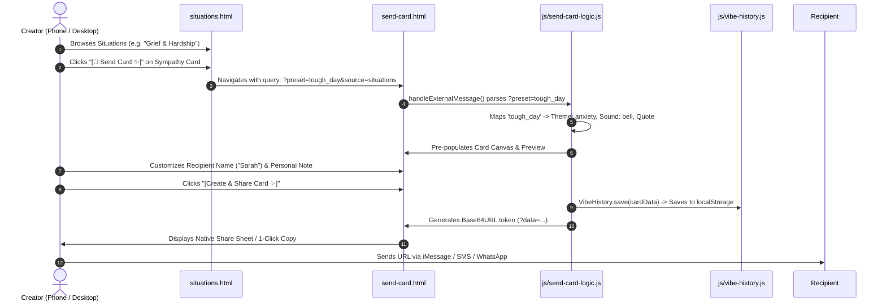
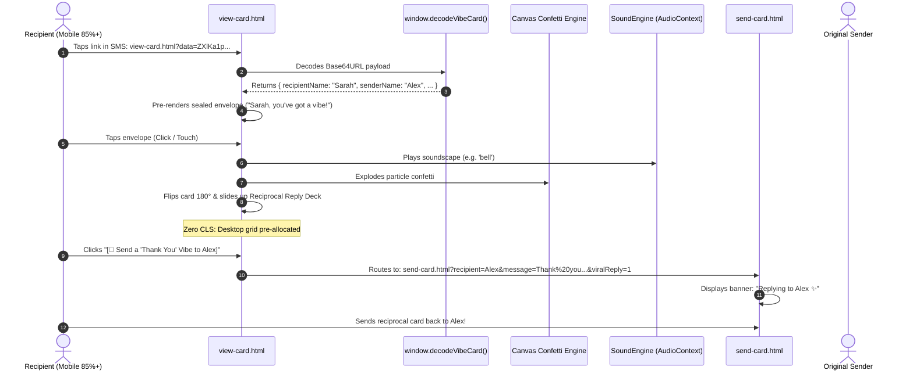
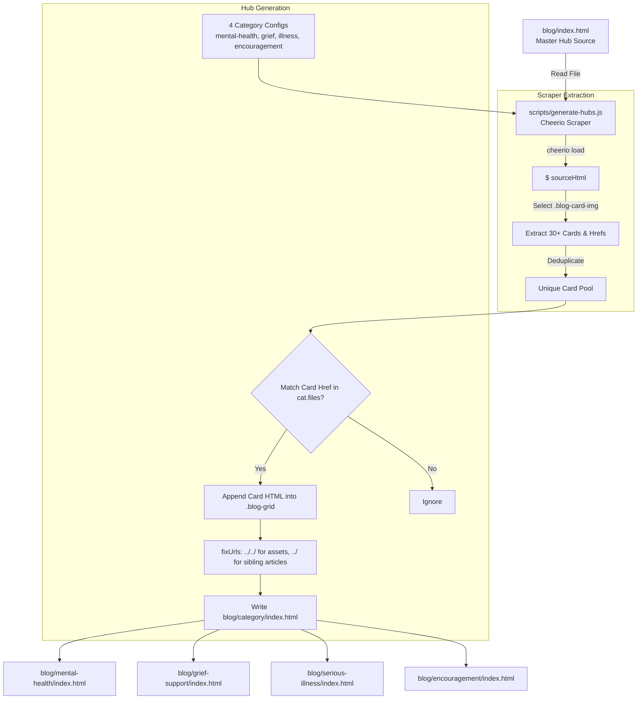

# Inter-System Data Contracts & Global Wiring Specification
**Document ID:** `SYSTEM_WIRING_SPEC.md`  
**Target Project:** The Vibe Check Project (`thevibecheckproject.com`)  
**Scope:** Global Frontend Ecosystem (Blog, FAQ, Studio, Homepage, Recipient Viewer, Dashboard, Situations Directory, and Build Scripts)  
**Status:** Canonical Technical Standard — Single Source of Truth  
**Date:** September 2026  

---

## 1. Executive Summary & Purpose

The purpose of this specification is to define the exact **inter-system communication protocols, data schemas, URL contracts, client-side storage structures, and compilation invariants** across the entire Vibe Check platform.

Before implementing or refactoring any production JavaScript, HTML, or CSS, developers and AI agents must adhere strictly to the signatures, schemas, and invariants defined in this document. **Zero ambiguous parameters, zero unhandled fallbacks, and zero undocumented mutations.**

---

## 2. The Global URL Query Parameter Registry

This registry documents every URL query parameter utilized across the platform for state transfer, preset initialization, and reciprocal viral loops.

### Master Parameter Registry Table

| Parameter Key | Alternative Aliases | Originating Surface | Target Destination | Data Type / Format | Validation & Fallback Behavior |
| :--- | :--- | :--- | :--- | :--- | :--- |
| **`data`** | *(none)* | `send-card.html` (Share Modal, SMS, Email, QR) | `view-card.html` | Base64URL-encoded JSON string | Must be valid Base64URL. If missing, corrupted, or parsing fails, `view-card.html` falls back to the **Canonical Default Card** (see Section 3.3). |
| **`preset`** | `template`, `occasion` | `situations.html`, `index.html`, `my-cards.html` | `send-card.html` | String (Lowercase Preset Slug) | Matched against `occasionTemplates` table. If unrecognized or omitted, defaults to `default` (General Free tier). See Preset Resolution Table below. |
| **`message`** | `msg` | `blog/*.html`, `templates/message-page.html`, `situations.html` | `send-card.html` | URI-encoded string (`encodeURIComponent`) | Sanitized for leading/trailing quotes (`"`, `“`, `”`). Decoded using `decodeURIComponent`. If missing, Card Studio retains the default affirmation quote. |
| **`recipient`** | `to` | `view-card.html` (Reciprocal Viral Bridge), `my-cards.html` | `send-card.html` | URI-encoded string (`encodeURIComponent`) | Decoded using `decodeURIComponent`. Pre-populates `#recipientName` and displays the Recipient Badge. If missing, remains empty. |
| **`viralReply`** | `reply` | `view-card.html` (Reciprocal Viral Bridge) | `send-card.html` | String: `'1'` or `'true'` | When `== '1'`, renders the `#viralReplyBanner` ("Replying to [Name] ✨"), focuses the personal note field, and sets telemetry tag `is_viral_reply=true`. |
| **`source`** | `ref` | `blog/*.html`, `situations.html`, `index.html` | `send-card.html` | String (Alphanumeric slug, e.g. `blog_panic`) | Used exclusively for telemetry routing (`window.VibeTelemetry.track('studio_funnel_entered', { source })`). No UI failure if omitted. |
| **`utm_campaign`** | *(none)* | External marketing, newsletter links | Global (`/`, `view-card.html`, etc.) | String (`card-view`, `newsletter-spark`) | Passes into Google Analytics / Clarity session tags. Ignored by client runtime logic. |

---

### Preset Resolution & Alias Mapping (`situations.html` $\rightarrow$ `send-card.html`)

When a user clicks **`[💌 Send Card ✨]`** on a situation card, it passes a `?preset=` slug. `js/send-card-logic.js` resolves this slug against `occasionTemplates`:

```typescript
type CanonicalPresetId = 'birthday' | 'tough_day' | 'proud' | 'gratitude' | 'calm' | 'healing';
```

| Incoming Parameter Value | Canonical Preset ID | Resolved Theme Group | Resolved Background | Resolved Sound | Default Card Quote |
| :--- | :--- | :--- | :--- | :--- | :--- |
| `birthday` | `birthday` | `birthday` | `sunset` (Free) / `gold` (Pro) | `sparkle` / `piano` | *"Another year of you making the world brighter ✨"* |
| `tough_day`, `hard_day`, `bad_day` | `tough_day` | `anxiety` | `dawn` (Free) / `velvet` (Pro) | `bell` / `musicbox` | *"Take a breath. You don't have to carry it all today."* |
| `proud`, `hype`, `celebrate` | `proud` | `celebrate` | `aurora` (Free) / `emerald` (Pro) | `sparkle` / `celebration` | *"Look how far you've come. I'm so proud of you!"* |
| `gratitude`, `thank_you`, `love` | `gratitude` | `love` | `rose` (Free) / `cherry` (Pro) | `chime` / `harp` | *"Just wanted to remind you how much you mean to me."* |
| `calm`, `anxiety`, `panic`, `burnout` | `calm` | `anxiety` | `dawn` (Free) / `ocean` (Pro) | `bell` / `ocean` | *"Breathe in calm, exhale worry. You are safe right now."* |
| `healing`, `grief`, `loss`, `illness` | `healing` | `healing` | `rose` (Free) / `crystal` (Pro) | `chime` / `harp` | *"Sending you gentle love and holding space for you today."* |
| *(unrecognized / empty)* | `default` | `default` | `default` | `chime` | *"You're trying, and that's what counts."* |

---

### Deep-Linking URL Hash Anchor Registry

URL fragments (hash anchors) enable direct navigation to specific sections or pre-opened states without page reloads:

| Hash Anchor | Target Page | Target Element ID | Behavioral Contract |
| :--- | :--- | :--- | :--- |
| `#crisis` | Global Navigation, `index.html`, `blog/index.html` | `#crisis` | Smooth-scrolls viewport to the 24/7 Crisis Hotline (988) support footer and pulses the hotline container border. |
| `#dailySpark` | `index.html` | `#dailySpark` | Scrolls to the Daily Spark dock, draws focus, and triggers a subtle celebratory card glow. |
| `#faq-free` | `faq.html` | `#faq-free` | Auto-expands *"Is sending a vibe check really free?"*, scrolls into view, and sets `aria-expanded="true"`. |
| `#faq-anonymous` | `faq.html` | `#faq-anonymous` | Auto-expands *"Can I remain anonymous when sending a card?"*. |
| `#faq-recipient-app` | `faq.html` | `#faq-recipient-app` | Auto-expands *"Does the recipient need to sign up or download an app?"*. |
| `#faq-history` | `faq.html` | `#faq-history` | Auto-expands *"Can I see cards I've sent in the past?"*. |
| `#faq-premium` | `faq.html` | `#faq-premium` | Auto-expands *"What is the Premium Unlock?"*. |

---

## 3. Card Serialization & Token Engine (`send-card.html` $\leftrightarrow$ `view-card.html`)

The card transmission engine is **strictly client-side and zero-database**. All information necessary to reconstruct, animate, play sound, and display the card must be serialized into the URL token.

### 3.1 Canonical Card Data Schema

```typescript
interface VibeCardPayload {
  /** Unique card execution identifier. Format: 'vibe_' + timestamp36 + '_' + rand6 */
  id: string;

  /** Recipient display name. Max 50 chars. */
  recipientName: string;

  /** Sender display name. Empty string indicates anonymous sender. */
  senderName: string;

  /** Primary affirmation displayed on front face of card. Max 280 chars. */
  affirmation: string;

  /** Optional personal note displayed on back face of card. Max 500 chars. */
  personalMessage?: string;

  /** Audio soundscape identifier. Matches SoundEngine registry. */
  sound: 'chime' | 'bell' | 'sparkle' | 'piano' | 'harp' | 'musicbox' | 'ocean' | 'celebration';

  /** Visual theme category token. Used for gradient fallbacks and badges. */
  themeGroup: 'default' | 'birthday' | 'anxiety' | 'celebrate' | 'love' | 'healing';

  /** Background asset reference: relative path to canvas asset, mp4 video, or css keyword. */
  background: string;

  /** ISO 8601 creation timestamp. */
  createdAt: string;

  /** Optional schema version for backward compatibility. Default: 1 */
  v?: number;
}
```

---

### 3.2 Serialization Pipeline (`send-card.html`)

When a card is created, `js/send-card-logic.js` executes the following strict 5-stage transformation pipeline:

```
┌────────────────────────┐
│  VibeCardPayload (Obj) │
└───────────┬────────────┘
            │ 1. JSON.stringify()
            ▼
┌────────────────────────┐
│   UTF-8 JSON String    │
└───────────┬────────────┘
            │ 2. encodeURIComponent() [Protects Unicode/Emojis (🎉, 💙, ✨)]
            ▼
┌────────────────────────┐
│  URI-Safe UTF-8 String │
└───────────┬────────────┘
            │ 3. btoa() [Binary-to-ASCII Base64]
            ▼
┌────────────────────────┐
│ Standard Base64 String │
└───────────┬────────────┘
            │ 4. Base64URL Conversion:
            │    .replace(/\+/g, '-')
            │    .replace(/\//g, '_')
            │    .replace(/=+$/, '')
            ▼
┌────────────────────────┐
│   Clean Base64URL      │
└───────────┬────────────┘
            │ 5. URL Construction:
            │    `${base}view-card.html?data=${encoded}`
            ▼
┌────────────────────────────────────────────────────────┐
│ Final Shareable Link (SMS, WhatsApp, Native Share)    │
└────────────────────────────────────────────────────────┘
```

#### Production JavaScript Implementation:
```javascript
function serializeVibeCard(cardData) {
  // 1. Ensure required defaults with character clamping
  let personalMsg = (cardData.personalMessage || '').trim().substring(0, 500);
  
  // Guard against emoji-dense expansions pushing URL over SMS gateway limits
  if (personalMsg.length > 350 && (encodeURIComponent(personalMsg).length > 600)) {
    personalMsg = personalMsg.substring(0, 320).trim() + '…';
  }

  const payload = {
    id: cardData.id || ('vibe_' + Date.now().toString(36) + '_' + Math.random().toString(36).substring(2, 8)),
    recipientName: (cardData.recipientName || '').trim().substring(0, 50),
    senderName: (cardData.senderName || '').trim().substring(0, 50),
    affirmation: (cardData.affirmation || '').trim().substring(0, 280),
    personalMessage: personalMsg,
    sound: cardData.sound || 'chime',
    themeGroup: cardData.themeGroup || 'default',
    background: cardData.background || 'default',
    createdAt: cardData.createdAt || new Date().toISOString(),
    v: 1
  };

  // 2. Serialize safely handling emojis and special characters
  let jsonStr = JSON.stringify(payload);
  let uriEncoded = encodeURIComponent(jsonStr);
  let base64 = btoa(uriEncoded);
  let encoded = base64.replace(/\+/g, '-').replace(/\//g, '_').replace(/=+$/, '');
  
  // 3. Final SMS / Carrier Safety Check: If encoded token exceeds 1,600 chars, clamp note and re-serialize
  if (encoded.length > 1600) {
    payload.personalMessage = payload.personalMessage.substring(0, 200).trim() + '…';
    encoded = btoa(encodeURIComponent(JSON.stringify(payload)))
      .replace(/\+/g, '-').replace(/\//g, '_').replace(/=+$/, '');
  }

  return encoded;
}
```

#### 3.2.1 URL Length Budget & Carrier Gateway Guardrail
- **The Physical Constraints:** Modern desktop browsers support URLs up to 2,048 characters. However, cellular SMS gateways, older Android messaging apps (Samsung Messages / AOSP SMS), and certain email security filters aggressively truncate URLs exceeding 1,500–1,800 characters.
- **Emoji UTF-8 Multiplier:** A single emoji (e.g. 🥳, 💙, 🌟) occupies 4 bytes in UTF-8 and encodes to 12 characters when passed through `encodeURIComponent` (e.g. `%F0%9F%A5%B3`), which expands the Base64 output significantly.
- **Budgeting Formula:**
  - Affirmation quote: max 280 chars (~300 bytes)
  - Recipient / Sender: max 50 chars each (~120 bytes)
  - Metadata & JSON boilerplate: ~150 bytes
  - Personal note: standard max 500 chars, but guarded dynamically.
- **Serialization Length Guard:**
  If the generated Base64URL token exceeds 1,600 characters, `serializeVibeCard` executes progressive truncation on `personalMessage` (clamping to 200 chars with `…`) before re-encoding. This guarantees that generated links **never exceed 1,800 characters total**, ensuring 100% deliverability across all cellular carriers and messaging apps.

---

### 3.3 Deserialization, Sanitization & Fallback Engine (`view-card.html`)

`view-card.html` executes an immediate preloader in `<head>` and a full DOM initialization script:

```javascript
window.decodeVibeCard = function (data) {
  if (!data || typeof data !== 'string') return getCanonicalFallbackCard();

  try {
    // 1. Sanitize incoming token: strip trailing slashes, spaces, and non-base64url characters
    // (Protects against SMS apps appending trailing slashes, e.g. view-card.html?data=ZXlKa.../)
    const cleanToken = String(data).trim().replace(/[^A-Za-z0-9\-_]/g, '');
    if (!cleanToken) return getCanonicalFallbackCard();

    // 2. Restore Base64URL to standard Base64
    let s = cleanToken.replace(/-/g, '+').replace(/_/g, '/');
    // 3. Re-pad '=' to multiple of 4
    s += '='.repeat((4 - (s.length % 4)) % 4);
    
    // 4. Decode Base64 and unpack URI component
    const rawJson = decodeURIComponent(atob(s));
    const parsed = JSON.parse(rawJson);

    // 5. Validate and sanitize fields
    return {
      id: String(parsed.id || 'vibe_fallback'),
      recipientName: sanitizeHtml(parsed.recipientName || ''),
      senderName: sanitizeHtml(parsed.senderName || ''),
      affirmation: sanitizeHtml(parsed.affirmation || "You're doing better than you think you are."),
      personalMessage: sanitizeHtml(parsed.personalMessage || ''),
      sound: ['chime','bell','sparkle','piano','harp','musicbox','ocean','celebration'].includes(parsed.sound) ? parsed.sound : 'chime',
      themeGroup: String(parsed.themeGroup || 'default'),
      background: String(parsed.background || 'default'),
      createdAt: parsed.createdAt || new Date().toISOString()
    };
  } catch (err) {
    console.warn('VibeCheck: Failed to parse card token payload. Falling back to default.', err);
    return getCanonicalFallbackCard();
  }
};

function sanitizeHtml(str) {
  return String(str)
    .replace(/&/g, '&amp;')
    .replace(/</g, '&lt;')
    .replace(/>/g, '&gt;')
    .replace(/"/g, '&quot;')
    .replace(/'/g, '&#039;');
}

function getCanonicalFallbackCard() {
  return {
    id: 'vibe_fallback',
    recipientName: '',
    senderName: '',
    affirmation: "You're doing better than you think you are.",
    personalMessage: "Someone wanted you to know you are appreciated today ✨",
    sound: 'chime',
    themeGroup: 'default',
    background: 'default',
    createdAt: new Date().toISOString()
  };
}
```

---

## 4. Client Storage Contracts (`localStorage` Schema)

Client storage enables the **My Vibes Dashboard (`my-cards.html`)** to maintain a persistent, zero-login record of cards crafted on that browser.

### 4.1 Storage Keys & Safari Private Browsing Quota Architecture

```
Master Storage Key:  'vibe_sent_cards_v1'
Max Records Cap:     50 records (Strict FIFO eviction)
Quota Tolerance:     Dual-Layer Memory Fallback (Safari Private Browsing & QuotaExceededError safe)
Multi-Tab Event:     'vibe:history-updated' (Dispatched via window.dispatchEvent)
```

#### The Safari Private Browsing Hazard:
In iOS Safari Private Browsing mode and older WebKit engines, `localStorage` is technically defined on `window`, but throws a fatal `QuotaExceededError: DOM Exception 22` on the very first `.setItem()` call (quota limit set to 0 bytes). In some mobile webviews, `localStorage.getItem()` may also throw security errors.

#### The Dual-Layer In-Memory Fallback Contract:
`js/vibe-history.js` implements a resilient `StorageSafe` wrapper maintaining an internal in-memory array `_inMemoryCards = []`:
- **When Reading:** Checks if `localStorage` is available. If reading throws or is blocked, it seamlessly returns `_inMemoryCards`.
- **When Writing:** Attempts `localStorage.setItem()`. If a `QuotaExceededError` or SecurityError is caught, it logs a silent warning and updates `_inMemoryCards`.
- The dashboard UI continues to function smoothly for the duration of the user's private browsing session with zero unhandled exceptions.

---

### 4.2 Stored Card Entity Interface

```typescript
interface StoredVibeCardRecord {
  /** Unique card ID (e.g. 'vibe_m0z8q1_k39f82') */
  id: string;

  /** Recipient display name. Default: 'Someone special' */
  recipient: string;

  /** Sender display name. Empty if anonymous. */
  sender: string;

  /** Affirmation quote text */
  affirmation: string;

  /** Theme group identifier (e.g. 'birthday', 'anxiety', 'healing') */
  theme: string;

  /** Sound identifier */
  sound: string;

  /** Personal note text */
  message: string;

  /** Full shareable URL (`https://thevibecheckproject.com/view-card.html?data=...`) */
  shareUrl: string;

  /** ISO 8601 creation timestamp */
  createdAt: string;

  /** Read receipt flag. True once verified by read-receipt engine */
  opened: boolean;

  /** Timestamp when recipient opened the card (if verified) */
  openedAt?: string;
}
```

---

### 4.3 CRUD Methods on `window.VibeHistory` (`js/vibe-history.js`)

| Method Signature | Parameters | Returns | Description |
| :--- | :--- | :--- | :--- |
| `VibeHistory.getAll()` | None | `StoredVibeCardRecord[]` | Reads storage, validates schema, sorts descending by `createdAt`. |
| `VibeHistory.get(id)` | `id: string` | `StoredVibeCardRecord \| null` | Finds a specific card by its unique ID. |
| `VibeHistory.save(card)` | `card: Partial<StoredVibeCardRecord>` | `StoredVibeCardRecord` | Upserts card by `id`. Pre-pends to array. Caps array at 50 items. Fires `vibe:history-updated`. |
| `VibeHistory.markOpened(id)` | `id: string` | `boolean` | Sets `opened = true` on the record. Updates storage. |
| `VibeHistory.delete(id)` | `id: string` | `boolean` | Removes record by ID. Fires `vibe:history-updated`. |
| `VibeHistory.clear()` | None | `boolean` | Wipes all records. Fires `vibe:history-updated` with `{ cleared: true }`. |

---

## 5. Shared JavaScript Utility Contracts (`js/script.js`)

To eliminate duplicate scripts and ensure responsive parity, common behaviors are exposed as standardized utilities on `window`.

### 5.1 Universal Item Filter Engine (`window.initItemFilter`)

Used by **FAQ (`faq.html`)**, **Situations Directory (`situations.html`)**, and **Blog Index (`blog/index.html`)**.

#### Method Signature
```typescript
interface ItemFilterConfig {
  inputId: string;           // Search <input> element ID
  containerId: string;       // Parent element ID containing items
  itemSelector: string;      // CSS selector for individual cards/items
  textSelector?: string;     // Inner selector for searchable text (default: searches whole item)
  pillSelector?: string;     // CSS selector for category filter buttons/tabs
  categoryAttr?: string;     // Attribute storing category key (default: 'data-category')
  activePillClass?: string;  // Class applied to active category button (default: 'active')
  onFilterChange?: (matchCount: number) => void; // Optional callback
}

function initItemFilter(config: ItemFilterConfig): void;
```

#### Behavioral Contract:
1. **Keyword Filtering:** Performs case-insensitive substring matching against `textSelector` content.
2. **Category Filtering:** When a pill is clicked, extracts `data-filter`. If `'all'`, shows all categories; otherwise matches against item `categoryAttr`.
3. **Combined AND Logic:** An item is visible if and only if: `matchesKeyword && matchesCategory`.
4. **Zero Layout Shift:** Non-matching items are set to `display: none;`. Empty state containers (e.g. `#noResultsMsg`) display automatically if `matchCount === 0`.

---

### 5.2 Universal Clipboard & Haptic Feedback (`window.copyText`)

Standardized clipboard helper across all blog posts, listicles, and share dialogs:

#### Method Signature
```typescript
function copyText(elementId: string, triggerElement: HTMLElement): Promise<boolean>;
```

#### Behavioral Contract:
1. Reads text content from element identified by `elementId`.
2. Strips leading and trailing decorative quotation marks (`"`, `“`, `”`).
3. Writes sanitized string to `navigator.clipboard.writeText(cleanText)`.
4. **Haptic Trigger:** On touch devices (`'vibrate' in navigator`), fires a subtle `15ms` haptic impulse: `navigator.vibrate([15])`.
5. **Visual Feedback:** 
   - Stores `triggerElement.innerHTML`.
   - Injects checkmark icon and text `"Copied! ✨"`.
   - Adds `.copied` class.
   - Automatically reverts to original markup and removes `.copied` after `2000ms`.
6. **Telemetry:** Dispatches `VibeTelemetry.track('text_copied', { elementId })`.

---

### 5.3 Bulletproof Metrics Counter Engine (`window.initMetricsCounters`)

Guarantees social proof counters never render as empty broken dashes (`—`).

#### Method Signature
```typescript
interface MetricsConfig {
  cardCounterId?: string;       // Default: 'liveCardCount'
  newsletterCounterId?: string; // Default: 'liveNewsletterCount'
  defaultCards?: number;        // Default: 12480
  defaultNewsletters?: number;  // Default: 5200
  timeoutMs?: number;           // Default: 3000
}

function initMetricsCounters(config?: MetricsConfig): void;
```

#### Behavioral Contract:
1. **Instant Baseline:** Immediately checks if element content contains `—` or is empty. If so, immediately writes verified baseline (`"12,480+"` and `"5,200+"`).
2. **Asynchronous Fetch:** Dispatches `fetch()` to CounterAPI endpoint with an `AbortController` timeout of 3000ms.
3. **Graceful Failure:** If the request succeeds and returns `count > baseline`, formats number with commas and updates the element. If network error, timeout, or rate-limiting occurs, **the baseline is preserved**. The element is never reverted to `—`.

---

### 5.4 Global Telemetry Contract (`window.VibeTelemetry`)

`window.VibeTelemetry` wraps Microsoft Clarity analytics with a resilient, offline-safe event queue.

#### Public API:
- `VibeTelemetry.track(eventName: string, meta?: Record<string, any>): void`
- `VibeTelemetry.setTag(key: string, value: string): void`

#### Canonical Telemetry Event Registry:
| Event Name | Metadata Payload | Triggering Condition |
| :--- | :--- | :--- |
| `card_creation_started` | `{ preset?: string, source?: string }` | User arrives on `send-card.html` with intent. |
| `card_created` | `{ theme: string, sound: string, isAnonymous: boolean }` | User successfully generates card link. |
| `card_share_initiated` | `{ method: 'native' \| 'clipboard' \| 'sms' \| 'whatsapp' }` | User clicks any share action in Studio or Viewer. |
| `card_opened` | `{ cardId: string }` | Recipient opens `view-card.html?data=...`. |
| `card_flipped` | `{ sound: string, theme: string }` | Recipient taps envelope/card to reveal message. |
| `reciprocal_reply_clicked` | `{ type: 'thank_you' \| 'warm_energy' \| 'pay_forward' }` | Recipient clicks viral reply bridge button. |
| `history_card_saved` | `{ theme: string, hasMessage: boolean }` | Card record added to local storage. |
| `history_card_deleted` | `{ cardId: string }` | Card record deleted from dashboard. |
| `blog_message_copied` | `{ messageId: string, slug: string }` | User clicks copy button on blog article. |
| `theme_switched` | `{ theme: 'editorial' \| 'kinetic' }` | User toggles design concept in dock. |

---

## 6. DOM & Scraper Target Invariants

The compilation scripts `scripts/generate-hubs.js` and `scripts/generate-listicles.js` parse HTML files directly via Cheerio. Modifying certain DOM structures without updating the build scripts will **break the static build pipeline**.

### 6.1 Scraper Invariants in `blog/index.html` (`scripts/generate-hubs.js`)

> [!CAUTION]
> **CRITICAL COMPILATION TARGETS**: `scripts/generate-hubs.js` reads `blog/index.html` and scrapes every card matching `.blog-card-img`. If these classes or attributes are altered, category hubs will be compiled with 0 articles!

| DOM Selector / Target | Script Expectation | Consequence if Modified |
| :--- | :--- | :--- |
| `a.blog-card-img` | Scraped to extract card HTML and `href`. | If class is renamed or converted to `<div>`, scraper returns 0 cards. Category hubs will be completely empty. |
| `href="[article-slug].html"` | Scraper checks `!href.startsWith('http')` and matches against category file lists. | If hrefs are made absolute or path format changes, articles will not be categorized. |
| `.pre-text`, `.drop-v`, `.rest-text` | Scraper targets these classes to update masthead titles per category. | If classes are removed, category page headers will have broken/missing titles. |
| `.sub-desc` | Scraper injects the generated category card grid immediately after `.sub-desc`. | If class is removed, the card grid will not be inserted into category hubs. |
| `.slider-wrapper` | Removed by scraper for category hub builds. | If renamed, category pages will inappropriately render the homepage carousel. |
| `.category-grid` | Removed and replaced by category-specific grid. | If renamed, legacy grids will persist on generated pages. |

---

### 6.2 Template Invariants in `templates/message-page.html` (`scripts/generate-listicles.js`)

> [!IMPORTANT]
> `scripts/generate-listicles.js` uses regex replacement against exact double-bracket token strings in `templates/message-page.html`.

| Template Token String | Replacement Source | Description |
| :--- | :--- | :--- |
| `{{title}}` | `list.title` | Replaced in `<title>`, `<meta property="og:title">`, and schema. |
| `{{header_title}}` | `list.header_title` | Replaced in the page `<h1>` headline. |
| `{{description}}` | `list.description` | Replaced in meta description and intro paragraph. |
| `{{slug}}` | `list.slug` | Replaced in canonical URL links. |
| `var(--dynamic-color)` | `list.color_theme` | Replaced with kinetic accent hex code (e.g., `#CDFF60`, `#FF6B9D`). |
| `{{messages_html}}` | `messagesHtml` string | Replaced with compiled feed of 50–100 copyable cards. |

---

## 7. End-to-End State Machine Flowcharts

### 7.1 Flow 1: Situations Directory $\rightarrow$ Card Creator Studio $\rightarrow$ Delivery



---

### 7.2 Flow 2: Recipient Unboxing $\rightarrow$ Reciprocal Viral Reply Loop



---

### 7.3 Flow 3: Static Blog Hub Compilation Pipeline



---

## 8. Compliance & Implementation Checklist

When writing or reviewing any code changes across the repository, verify compliance against this checklist:

- [ ] **URL Parameters:** Are parameter keys matching the Master Registry (`preset`, `message`, `recipient`, `viralReply`, `data`)?
- [ ] **Emoji Safety:** Are all user strings passed through `encodeURIComponent` before `btoa`, and decoded with `decodeURIComponent(atob(s))`?
- [ ] **Base64URL Format:** Are all card share tokens utilizing the URL-safe Base64URL format (`-`, `_`, no padding `=`)?
- [ ] **Fallback Guarantee:** Does `view-card.html` render the Canonical Default Card if the URL parameter is missing or corrupted, with zero console crashes?
- [ ] **Storage Quota:** Does `vibe-history.js` wrap all `localStorage` calls in `try/catch` with a 50-card FIFO cap?
- [ ] **Scraper Safety:** Has any change to `blog/index.html` preserved `a.blog-card-img`, `.pre-text`, `.drop-v`, `.rest-text`, and `.sub-desc`?
- [ ] **Universal Filter:** Do `faq.html` and `situations.html` use `window.initItemFilter()` instead of separate inline search scripts?
- [ ] **Touch vs. Hover:** Are all 3D tilts and hover glows strictly wrapped in `@media (hover: hover) and (pointer: fine)` with touch targets maintaining $\ge 48\text{px}$?

---
*End of Inter-System Data Contracts & Global Wiring Specification.*
