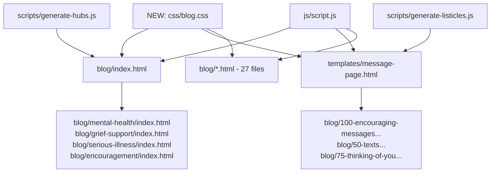

# Architectural Revision: Blog Ecosystem
**Target Scope:** Main Blog Hub (`/blog/index.html`), Category Hubs (`/blog/*/index.html`), and Post Archetypes (`templates/message-page.html` & `blog/*.html`)  
**Date:** September 2026  
**Status:** Unified Technical Proposal (Responsive Parity & Ergonomic Balance)  

---

## Executive Overview & The Reality of the Funnel
The Blog ecosystem is the primary organic acquisition, Pinterest discovery, and SEO doorway for **The Vibe Check Project**. Its most critical role is converting passive readers seeking advice into active card senders through the **"Read → Copy → Send as Card"** funnel.

**The Reality of the Audience:**
Over **70% of blog visitors arrive on mobile devices** via social feeds, SMS shares, and search queries (e.g., *"what to text a friend whose mom is sick"*). The previous proposal over-corrected for 1920px desktop margins by introducing a complex 3-column desktop layout that risked bloating mobile performance and breaking the mobile reading flow.

This revised specification adopts **Device-Appropriate Parity**: a single unified HTML/DOM structure that delivers a seamless, thumb-ergonomic reading experience on mobile while naturally expanding into a widescreen magazine layout on desktop—without duplicate markup or conflicting state.

---

## 1. What It Shows & How It Is Coded

### Current Presentation
1. **The Blog Hub (`/blog/index.html`):**
   - Masthead with SVG `clipPath` smoke mask, animated rotating action words, and category quick-jump chips.
   - 4 Category Cards (*Mental Health*, *Grief & Loss*, *Serious Illness*, *Encouragement*) with browser-default blue link text.
   - Interactive 3D carousel rotating category pillars.
   - Responsive card grid displaying ~30 editorial articles.
2. **Editorial Articles (`blog/*.html`):**
   - Single centered 800px column containing high-contrast text, callout stats, and copyable text blocks.
3. **Listicle Articles (`100-encouraging-messages...html`):**
   - Statically generated feeds of 50–100 copyable message cards with "Copy" and "Send as Card" triggers.

### Existing Code Architecture & Scraper Dependencies
- **Hybrid CSS:** 450+ lines of duplicate inline `<style>` inside `<head>` across `blog/index.html`, `templates/message-page.html`, and 27 static blog posts.
- **Scraper Pipeline Dependency (`scripts/generate-hubs.js`):**
  > [!IMPORTANT]
  > `scripts/generate-hubs.js` uses `cheerio` to scrape `.blog-card-img` elements directly from `blog/index.html`. It inspects `a.blog-card-img`, extracts child `` sources, titles, and paths, and compiles the 4 sub-hub pages. **Any change to card markup in `blog/index.html` must preserve these exact Cheerio selector targets.**
- **Listicle Generator Pipeline (`scripts/generate-listicles.js`):**
  - Compiles message lists from JSON into `templates/message-page.html`. Modifying the master template automatically updates all listicle pages upon running `node scripts/generate-listicles.js`.

---

## 2. The Shared Architecture (Single DOM & Unified State Logic)

To maintain absolute code cleanliness, mobile and desktop share a **100% identical DOM hierarchy**:

```
<article class="blog-article-wrapper">
  <!-- Sticky Table of Contents (Collapsible Drawer on Mobile, Sticky Rail on Desktop) -->
  <aside class="article-toc-rail" id="articleToc">
    <nav class="toc-nav" aria-label="Table of Contents">...</nav>
  </aside>

  <!-- Core Reading Stream -->
  <div class="article-content-body">
    <header class="article-masthead">...</header>
    <div class="article-prose">...</div>
    
    <!-- Copyable Message Blocks (SMS Chat Bubbles) -->
    <div class="sms-message-bubble" data-message-id="msg-101">
      <div class="sms-bubble-text">"Thinking of you today. Zero need to reply — just wanted you to feel loved."</div>
      <div class="sms-bubble-actions">
        <button class="btn-copy-sms" onclick="copyText('msg-101', this)" aria-label="Copy message">
          <svg class="icon-copy">...</svg> <span>Copy</span>
        </button>
        <a href="../send-card.html?message=..." class="btn-send-as-card">
          <span>Send as Card ✨</span>
        </a>
      </div>
    </div>
  </div>

  <!-- Shared Contextual Drawer / Sandbox Rail -->
  <aside class="article-conversion-rail" id="conversionRail">
    <div class="sticky-card-preview-dock">
      <div class="mini-live-card-preview">...</div>
      <div class="related-guides-box">...</div>
    </div>
  </aside>
</article>
```

### Shared Logic & State Engine
- **Universal Clipboard & Telemetry (`js/script.js`):** Single `copyText(id, btn)` function that handles `navigator.clipboard.writeText`, plays haptic feedback on mobile (`navigator.vibrate([15])`), toggles the `"Copied!"` badge, and logs `Telemetry.track('blog_message_copied')`.
- **Card Builder Handoff:** Seamless URL query handoff (`../send-card.html?message=${encodeURIComponent(text)}&source=blog_${category}`) ensuring zero state drop-off when transitioning from blog to card builder.

---

## 3. The Mobile Experience (Thumb-First Ergonomics)

With >70% of readers on iOS/Android, every interaction must prioritize thumb ergonomics:

1. **Sticky Bottom Conversion Bridge (`position: sticky; bottom: 0;`):**
   - In long listicle articles (e.g., *100 Encouraging Messages*), scrolling past 50 items creates scroll fatigue.
   - A discreet, floating bottom bar stays anchored within the bottom 40% thumb zone:
     ```css
     .mobile-reading-dock {
       position: sticky;
       bottom: 0;
       z-index: 100;
       padding-bottom: env(safe-area-inset-bottom, 16px);
       backdrop-filter: blur(20px);
     }
     ```
   - Features a 1-tap **`[🎲 Random Spark]`** shuffle button to jump to an inspiring message and a **`[💌 Create Custom Card]`** persistent button.
2. **Horizontal Swipeable Topic Pill Rail:**
   - On `/blog/index.html`, category filters (*Mental Health*, *Grief*, *Illness*, *Encouragement*) render as an edge-to-edge scrollable pill rail with `scroll-snap-type: x mandatory` and `-webkit-overflow-scrolling: touch`.
3. **Tactile SMS Chat Bubbles:**
   - Copyable templates are styled as high-contrast iMessage/WhatsApp chat bubbles.
   - Buttons have minimum **48px touch targets** (`min-height: 48px; min-width: 48px;`).
   - Tactile feedback: Active press invokes immediate visual compression (`:active { transform: scale(0.97); }`).
4. **Bottom-Sheet Table of Contents:**
   - Instead of a side rail that breaks layout, mobile readers tap a floating `"📑 Contents (4 min)"` pill in the bottom corner that slides up as a native-feeling bottom sheet modal.

---

## 4. The Desktop Experience (Widescreen Balance & Mouse Precision)

On displays $\ge 1280\text{px}$, the single DOM naturally unlocks widescreen spatial balance:

1. **Fluid 3-Tier Magazine Layout:**
   - **Left Rail (260px Sticky):** Clean Table of Contents with reading progress indicator line that illuminates as sections enter the viewport.
   - **Center Column (700px–740px):** Strict line-length governance (65–75 characters per line) for optimal reading ergonomics and zero eye-fatigue.
   - **Right Rail (320px Sticky):** **Live Card Preview Dock**. Hovering or clicking any copyable message in the article instantly renders that text on a floating 3D affirmation card on the right, with a 1-click `[Send This Card ✨]` button.
2. **Expanded Hub Grid (4 Columns on $\ge 1600\text{px}$):**
   - Hub cards expand from 3 columns to 4 columns, filling the screen with rich visual cards rather than leaving dead black margins.
3. **Mouse Precision & Interactive Hover:**
   - Mouse hover over blog cards activates the 3D perspective tilt and illuminated neon border accents.
   - Live search input in the hub command bar filters 35+ guides in real time with instant keyword highlights.

---

## 5. The Fluid CSS / Responsive Mechanics

### Fluid Container & Breakpoint Grid
```css
/* Shared Fluid Container */
.blog-container,
.blog-article-wrapper {
  width: min(100% - 32px, 1440px);
  margin-inline: auto;
}

/* Mobile Default (<1100px): Streamlined 1-Column Feed */
.blog-article-wrapper {
  display: flex;
  flex-direction: column;
}
.article-toc-rail,
.article-conversion-rail {
  display: none; /* Accessible via mobile bottom-sheet modal */
}

/* Desktop Grid Breakpoint (≥1100px): 3-Tier Balance */
@media (min-width: 1100px) {
  .blog-article-wrapper {
    display: grid;
    grid-template-columns: 240px minmax(680px, 760px) 320px;
    gap: 40px;
    align-items: start;
  }
  
  .article-toc-rail,
  .article-conversion-rail {
    display: block;
    position: sticky;
    top: 100px;
    max-height: calc(100vh - 120px);
    overflow-y: auto;
  }
}

/* Blog Hub Grid: Auto-Fit Fluid Cards */
.blog-grid {
  display: grid;
  grid-template-columns: repeat(auto-fill, minmax(min(100%, 340px), 1fr));
  gap: 28px;
}
```

### Strict Touch vs. Hover Guard
```css
/* Touch Devices: Immediate Tactile Touch */
@media (hover: none) {
  .sms-message-bubble:active {
    transform: scale(0.98);
    transition: transform 0.1s ease;
  }
}

/* Desktop Only: 3D Cursor Tilt & Smooth Highlights */
@media (hover: hover) and (pointer: fine) {
  .blog-card-img:hover {
    transform: translateY(-6px) scale(1.01);
    box-shadow: 0 16px 36px rgba(0, 0, 0, 0.4), 0 0 24px rgba(255, 107, 157, 0.25);
  }
  .sms-message-bubble:hover {
    border-color: var(--color-primary, #FF6B9D);
  }
}
```

### Fluid Typography
```css
.blog-header h1 {
  font-size: clamp(2rem, 5vw, 3.5rem);
  line-height: 1.15;
}
.article-content-body h2 {
  font-size: clamp(1.5rem, 3.5vw, 2.25rem);
  line-height: 1.25;
}
```

---

## 6. Prioritized Implementation Tasks

### Phase 0: Hotfixes & Scraper Preservation
1. **Header Grammar Typo:** Change `"The Vibe Check's Guide's"` $\rightarrow$ `"The Vibe Check Guides"`.
2. **Category Links Contrast:** Replace browser-default unstyled blue links (`#0000ee`) on the 4 topic cards with styled kinetic accent pills (`var(--color-primary)`).
3. **Scraper Selector Lock:** Verify and lock the Cheerio scraping target selectors (`.blog-card-img`, `data-title`, `img`) in [blog/index.html](file:///c:/Users/devin/OneDrive/Website/blog/index.html) so [scripts/generate-hubs.js](file:///c:/Users/devin/OneDrive/Website/scripts/generate-hubs.js) never breaks.

### Phase 1: Consolidated CSS & Ergonomic Restructuring
1. **Dedicated Stylesheet (`css/blog.css`):** Extract 450+ lines of duplicate inline `<style>` tags into a shared stylesheet.
2. **Universal Search Integration:** Integrate blog card search into the shared search helper in [js/script.js](file:///c:/Users/devin/OneDrive/Website/js/script.js).
3. **Mobile Bottom Actions & Sticky TOC:** Implement the mobile sticky bottom helper bar for listicles and the responsive 3-tier desktop grid for articles.
4. **Recompile Generator Templates:** Update [templates/message-page.html](file:///c:/Users/devin/OneDrive/Website/templates/message-page.html) and run [scripts/generate-listicles.js](file:///c:/Users/devin/OneDrive/Website/scripts/generate-listicles.js).

---

## 7. File Revision Dependency Graph



### Detailed File Changes:
| File Path | Role | Necessary Changes |
| :--- | :--- | :--- |
| **`css/blog.css`** *(NEW)* | Shared Blog Stylesheet | Extract inline styles, define responsive parity rules, SMS bubbles, and fluid auto-fit grids. |
| **[blog/index.html](file:///c:/Users/devin/OneDrive/Website/blog/index.html)** | Main Hub Master | Fix typo, link `css/blog.css`, add search input, and safeguard Cheerio scraper selectors. |
| **[templates/message-page.html](file:///c:/Users/devin/OneDrive/Website/templates/message-page.html)** | Master Template | Incorporate mobile sticky action bar, desktop TOC rail, and SMS chat bubble styling. |
| **[scripts/generate-listicles.js](file:///c:/Users/devin/OneDrive/Website/scripts/generate-listicles.js)** | Compiler | Re-run script to propagate template updates across all listicles. |
| **[scripts/generate-hubs.js](file:///c:/Users/devin/OneDrive/Website/scripts/generate-hubs.js)** | Category Hub Generator | Verify Cheerio selectors and recompile category hubs. |
| **[js/script.js](file:///c:/Users/devin/OneDrive/Website/js/script.js)** | Core Scripts | Add client-side card filtering helper and scroll-spy TOC tracking. |
