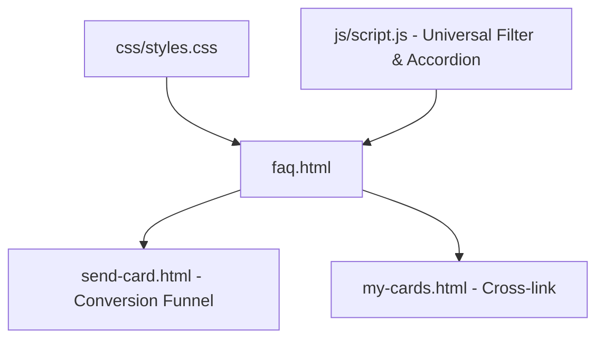

# Architectural Revision: FAQ Page
**Target File:** `faq.html`  
**Date:** September 2026  
**Status:** Unified Technical Proposal (Responsive Parity & Ergonomic Balance)  

---

## Executive Overview & The Reality of the Funnel
The FAQ page (`faq.html`) is a trust-building gateway. Visitors land here when they have high friction, hesitation, or anxiety about using the platform: *"Is it truly anonymous?"*, *"Does my recipient need an app?"*, *"Is there a hidden subscription?"*.

**The Reality of the Audience:**
Over **70% of FAQ visits occur on mobile devices**—often directly from a prompt or link inside the card creator or a shared text message. The previous proposal over-indexed on filling desktop 1920px margins with a 3-column support studio and sandbox card demo, which would introduce excessive visual clutter and hurt mobile load performance.

This revised architectural proposal establishes **Device-Appropriate Parity**:
- **On Mobile:** Streamlined, full-width thumb-accessible accordion rows (min 48px touch targets) with an edge-to-edge swipeable category pill rail and sticky bottom CTA.
- **On Desktop:** Balanced 2-column layout pairing a sticky left search & topic navigation rail with clean accordion cards on the right.
- **Shared Rule:** A single unified DOM structure and **one universal client-side search helper in [js/script.js](file:///c:/Users/devin/OneDrive/Website/js/script.js)** (zero isolated filter scripts).

---

## 1. What It Shows & How It Is Coded

### Current Presentation & Flaws
1. **Hero Section (`min-height: 50vh`):** Consumes 450px–540px of vertical height just for two lines of text, forcing all 7 questions below the fold on mobile and desktop.
2. **Accordion Question Stream (7 Items):**
   - Q1: *Is sending a vibe check really free?*
   - Q2: *Does the recipient need to sign up or download an app?*
   - Q3: *Can I remain anonymous when sending a card?*
   - Q4: *Can I see cards I've sent in the past?*
   - Q5: *What is the Premium Unlock?*
   - Q6: *How does the daily affirmation newsletter work?*
   - Q7: *Do you provide counseling or medical advice?*
3. **Bottom CTA Card:** Box prompting users to send an affirmation card.

### Current Code & Redundancy Audit
- **Schema.org Desynchronization:** The JSON-LD schema in `<head>` only has **6 questions**, missing Q4 (*"Can I see cards I've sent in the past?"*).
- **JavaScript Redundancy:** Conflicting duplicate `toggleFaq()` functions exist between an inline `<script>` in `faq.html` and lines 188–230 in [js/script.js](file:///c:/Users/devin/OneDrive/Website/js/script.js).
- **Styles:** Hardcoded `.faq-container` with `max-width: 800px` in [css/styles.css](file:///c:/Users/devin/OneDrive/Website/css/styles.css).

---

## 2. The Shared Architecture (Single DOM & Unified State Logic)

Mobile and desktop share an identical semantic DOM. The layout mode transitions fluidly via CSS Grid:

```html
<section class="faq-workspace-wrapper">
  <!-- Shared Search & Filter Rail (Horizontal Pill Rail on Mobile, Sticky Left Rail on Desktop) -->
  <aside class="faq-filter-rail" id="faqFilterRail">
    <div class="faq-search-box">
      <input type="search" id="faqSearchInput" placeholder="Search questions (e.g. anonymous, free)..." aria-label="Search FAQ">
    </div>
    <div class="faq-category-pills" role="tablist">
      <button class="faq-pill active" data-filter="all">All (7)</button>
      <button class="faq-pill" data-filter="privacy">Privacy & Safety (2)</button>
      <button class="faq-pill" data-filter="cards">Sending Cards (3)</button>
      <button class="faq-pill" data-filter="support">Support & Crisis (2)</button>
    </div>
  </aside>

  <!-- Accordion List Column -->
  <div class="faq-accordion-column">
    <div class="faq-accordion" id="faqAccordion">
      <div class="faq-item" data-category="cards" id="faq-free">
        <button class="faq-question" aria-expanded="true" aria-controls="faq-ans-1">
          <span class="faq-question-text">Is sending a vibe check really free?</span>
          <span class="faq-icon" aria-hidden="true">+</span>
        </button>
        <div class="faq-answer" id="faq-ans-1" role="region">
          <div class="faq-answer-content">
            <p>Yes, 100% free forever. No credit card, no account required.</p>
          </div>
        </div>
      </div>
      <!-- Additional FAQ Items with data-category and ID anchors -->
    </div>

    <!-- Bottom Conversion Card -->
    <div class="faq-conversion-card">
      <h3>Ready to brighten someone's day?</h3>
      <p>Takes 30 seconds to send a heartfelt, animated affirmation card.</p>
      <a href="send-card.html" class="btn btn-primary">Send a Free Card Now ✨</a>
    </div>
  </div>
</section>
```

### Unified Client-Side Search Helper
Instead of separate one-off search scripts (`faq-filter.js`, `situations-filter.js`), a **single reusable filter helper** is added to [js/script.js](file:///c:/Users/devin/OneDrive/Website/js/script.js):

```javascript
// Universal client-side filter engine in js/script.js
window.initItemFilter = function({ inputId, containerId, itemSelector, textSelector, pillSelector, categoryAttr = 'data-category' }) {
  const input = document.getElementById(inputId);
  const container = document.getElementById(containerId);
  if (!container) return;
  const items = container.querySelectorAll(itemSelector);
  const pills = pillSelector ? document.querySelectorAll(pillSelector) : [];
  let currentCategory = 'all';

  function applyFilter() {
    const query = input ? input.value.trim().toLowerCase() : '';
    items.forEach(item => {
      const text = textSelector ? item.querySelector(textSelector)?.textContent.toLowerCase() || '' : item.textContent.toLowerCase();
      const cat = item.getAttribute(categoryAttr) || '';
      const matchesCategory = currentCategory === 'all' || cat.includes(currentCategory);
      const matchesQuery = !query || text.includes(query);
      item.style.display = matchesCategory && matchesQuery ? '' : 'none';
    });
  }

  if (input) input.addEventListener('input', applyFilter);
  pills.forEach(pill => {
    pill.addEventListener('click', () => {
      pills.forEach(p => p.classList.remove('active'));
      pill.classList.add('active');
      currentCategory = pill.getAttribute('data-filter') || 'all';
      applyFilter();
    });
  });
};
```

---

## 3. The Mobile Experience (Thumb-First Ergonomics)

1. **Elimination of Hero Dead Space:**
   - Replacing `min-height: 50vh` with compact padding (`padding: 36px 16px 20px;`) places the search bar and the first question immediately above the fold on mobile screens.
2. **Horizontal Swipeable Topic Pills:**
   - Topic pills (*All*, *Privacy & Safety*, *Sending Cards*, *Support*) sit in a smooth horizontal scroll rail with `scroll-snap-type: x mandatory` and `-webkit-overflow-scrolling: touch` directly under the search bar.
3. **48px Minimum Hit Areas & Tactile Compression:**
   - Every accordion header has `min-height: 52px; padding: 14px 18px;` to ensure instant, fat-finger-friendly tapping without accidental miss-clicks.
   - Tactile feedback: `:active { background: rgba(255, 255, 255, 0.08); transform: scale(0.99); }`.
4. **Single-Open Accordion State:**
   - Expanding a question automatically collapses the previous one on mobile, preserving viewport context so the user is never stranded 800px down a tall page.
5. **Sticky Bottom Conversion Bar:**
   - On mobile, when users scroll past question 3, a sleek floating bottom pill `[💌 Send a Free Card Now]` anchors at the bottom of the screen within thumb reach (`env(safe-area-inset-bottom)`).

---

## 4. The Desktop Experience (Widescreen Balance & Mouse Precision)

On displays $\ge 1024\text{px}$, the layout transitions from a vertical stack to an ergonomic **2-Column Layout**:

```
┌────────────────────────────────────────────────────────────────────────────────────────┐
│  ✨ Frequently Asked Questions                                                         │
│  Everything you need to know about privacy, cards, and zero-cost delivery              │
├──────────────────────────────┬─────────────────────────────────────────────────────────┤
│  LEFT STICKY RAIL (320px)    │  RIGHT CONTENT COLUMN (Flexible 760px–860px)            │
│                              │                                                         │
│  🔍 Live Keyword Search      │  ▼ [Privacy & Anonymity]                                │
│  [Type: anonymous, free...]  │    Can I remain anonymous when sending a card?          │
│                              │    Yes! Toggle "Someone special ✨" at checkout...      │
│  Topic Categories:           │                                                         │
│  • All Questions (7)         │  ▶ Does the recipient need to sign up or download app?  │
│  • Privacy & Safety (2)      │                                                         │
│  • Sending Cards (3)         │  ▶ Is sending a vibe check really free?                 │
│  • Support & Crisis (2)      │                                                         │
│                              │  ▶ Can I see cards I've sent in the past?               │
│  💬 Still Have Questions?    │                                                         │
│  • Direct Contact Form       │  ┌───────────────────────────────────────────────────┐  │
│  • 24/7 Crisis Hotline (988) │  │  Ready to brighten someone's day?                 │  │
│                              │  │  [ Send a Free Card Now ✨ ]                      │  │
└──────────────────────────────┴──┴───────────────────────────────────────────────────┘──┘
```

1. **Sticky Navigation Rail:**
   - Left rail stays anchored at `top: 100px` as the user scrolls through questions.
2. **Deep-Linking / URL Anchor Detection:**
   - Navigating to `faq.html#anonymous` automatically opens question 3, highlights its border in accent gold/coral, and scrolls it into view.
3. **Precision Mouse Hover:**
   - Hovering over questions smoothly highlights the left border with an illuminated gradient accent line (`#FF6B9D` to `#FEC84A`).

---

## 5. The Fluid CSS / Responsive Mechanics

### Fluid Grid Geometry
```css
/* Shared Fluid Wrapper */
.faq-workspace-wrapper {
  width: min(100% - 32px, 1240px);
  margin-inline: auto;
  padding-bottom: 80px;
}

/* Mobile Default (<1024px): 1-Column Stack */
.faq-workspace-wrapper {
  display: flex;
  flex-direction: column;
  gap: 24px;
}
.faq-filter-rail {
  display: flex;
  flex-direction: column;
  gap: 12px;
}
.faq-category-pills {
  display: flex;
  overflow-x: auto;
  gap: 8px;
  padding-bottom: 6px;
  scrollbar-width: none;
}
.faq-category-pills::-webkit-scrollbar {
  display: none;
}

/* Desktop Breakpoint (≥1024px): 2-Column Split */
@media (min-width: 1024px) {
  .faq-workspace-wrapper {
    display: grid;
    grid-template-columns: 320px 1fr;
    gap: 48px;
    align-items: start;
  }
  
  .faq-filter-rail {
    position: sticky;
    top: 100px;
    max-height: calc(100vh - 120px);
  }
  
  .faq-category-pills {
    flex-direction: column;
    overflow-x: visible;
  }
}
```

### Touch vs. Hover Isolation
```css
/* Mobile Touch Target & Tap State */
.faq-question {
  min-height: 52px;
  display: flex;
  align-items: center;
  justify-content: space-between;
  width: 100%;
}

@media (hover: none) {
  .faq-question:active {
    background: rgba(255, 255, 255, 0.06);
    transform: scale(0.99);
  }
}

/* Desktop Hover Accents */
@media (hover: hover) and (pointer: fine) {
  .faq-item:hover {
    border-color: rgba(255, 107, 157, 0.35);
    box-shadow: 0 8px 24px rgba(0, 0, 0, 0.3);
  }
}
```

### Fluid Typography & Hero Adjustment
```css
.faq-hero {
  padding: clamp(36px, 5vw, 64px) 20px clamp(20px, 3vw, 36px);
  text-align: center;
}
.faq-hero h1 {
  font-size: clamp(2rem, 4.5vw, 3.25rem);
  line-height: 1.15;
}
```

---

## 6. Prioritized Implementation Tasks

### Phase 0: Hotfixes & Data Cleanup
1. **Reduce Hero Padding:** Remove `min-height: 50vh; padding-top: 120px;` in [faq.html](file:///c:/Users/devin/OneDrive/Website/faq.html) to bring questions above the fold.
2. **Synchronize Schema.org JSON-LD:** Add the missing question (*"Can I see cards I've sent in the past?"*) to the JSON-LD in `<head>`.
3. **De-duplicate Accordion JavaScript:** Remove the inline `window.toggleFaq()` script from [faq.html](file:///c:/Users/devin/OneDrive/Website/faq.html) and standardize on the event listener in [js/script.js](file:///c:/Users/devin/OneDrive/Website/js/script.js).

### Phase 1: Responsive Parity & Universal Filter
1. **Universal Filter Helper:** Implement `initItemFilter` in [js/script.js](file:///c:/Users/devin/OneDrive/Website/js/script.js) and initialize it for the FAQ search input and category pills.
2. **2-Column Desktop Grid:** Add responsive grid layout rules to [css/styles.css](file:///c:/Users/devin/OneDrive/Website/css/styles.css) (`@media (min-width: 1024px)`).
3. **URL Anchor Support:** Add hash detection to automatically expand targeted questions upon load.

---

## 7. File Revision Dependency Graph



### Detailed File Changes:
| File Path | Role | Necessary Changes |
| :--- | :--- | :--- |
| **[faq.html](file:///c:/Users/devin/OneDrive/Website/faq.html)** | Page Markup | Remove `50vh` hero, sync Schema JSON-LD (all 7 Qs), add category pill rail markup, add anchor IDs, and remove duplicate inline JS. |
| **[css/styles.css](file:///c:/Users/devin/OneDrive/Website/css/styles.css)** | Core Styles | Define `@media (min-width: 1024px)` 2-column grid, mobile horizontal scroll pills, and touch-safe active states. |
| **[js/script.js](file:///c:/Users/devin/OneDrive/Website/js/script.js)** | Shared Script | Implement universal `initItemFilter()`, consolidate accordion event delegation, and add URL hash listener. |
