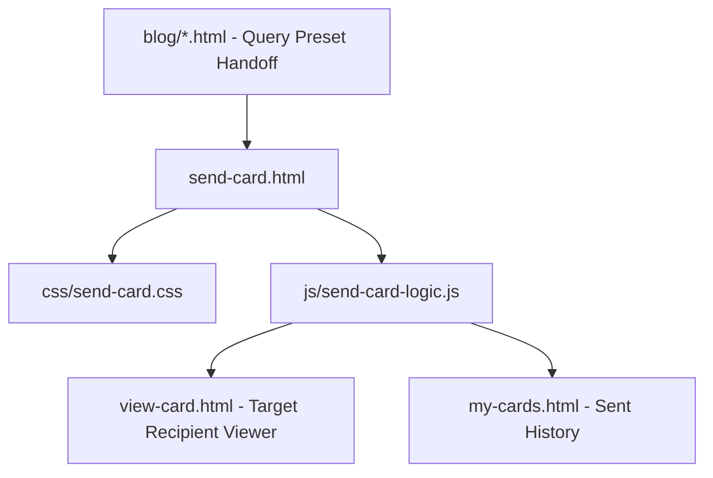

# Architectural Revision: Card Creator Studio
**Target File:** `send-card.html` (with `css/send-card.css` & `js/send-card-logic.js`)  
**Date:** September 2026  
**Status:** Unified Technical Proposal (Responsive Parity & Ergonomic Balance)  

---

## Executive Overview & The Reality of the Funnel
The Card Creator Studio (`send-card.html`) is the core engine, value generator, and conversion epicenter of **The Vibe Check Project**. Every viral share, blog post CTA, and situational guide funnels users directly into this creation pipeline.

**The Reality of the Audience:**
Over **70% of cards are created on mobile phones**. The previous desktop-heavy proposal suggested a full 3-column studio canvas that risked cannibalizing mobile ergonomics or introducing complex dual-mode toggles (`Guided Wizard vs. Studio Canvas`).

This revised specification adheres strictly to **Device-Appropriate Parity**:
- **Zero Split State:** A single unified state engine in [js/send-card-logic.js](file:///c:/Users/devin/OneDrive/Website/js/send-card-logic.js) controls one shared HTML DOM structure. No dual-mode switches or separate mobile/desktop forks.
- **On Mobile:** A **Sticky Preview + Bottom-Sheet Creation Drawer**. The live card stays visible and pinned at the top of the viewport, while controls (presets, message selection, theme, recipient inputs) scroll smoothly from below, keeping all primary navigation within comfortable thumb reach (`position: sticky; bottom: 0;`).
- **On Desktop:** The same DOM elements naturally fan out into an expansive **3-Column Creative Studio** (Panel 1: Tone & Content $\rightarrow$ Panel 2: Interactive 3D Stage $\rightarrow$ Panel 3: Aesthetics & Send).

---

## 1. What It Shows & How It Is Coded

### Current Studio Components
1. **Header & Progress:** Sunset gradient title `✨ Send a Vibe Check` and 3-step navigation indicator (`Your Vibe`, `The Look`, `Send It`).
2. **Step 1: Your Vibe:**
   - 6 Quick Occasion Presets (*Birthday, Tough Day, Proud, Gratitude, Calm, Healing*).
   - Category affirmation tabs (*General, Calm, Celebrate, Love, Healing*).
   - 2-column affirmation quote selection grid.
3. **Step 2: The Look & Sound:**
   - Background themes selector (gradients, dynamic canvases, artwork).
   - Ambient soundscape picker (8 audio options with preview buttons).
4. **Step 3: Recipient & Send:**
   - Recipient Name, Sender Name (or anonymous *"Someone special ✨"* toggle), Personal Note textarea, and optional delivery triggers.
5. **Right-Side Card Preview:**
   - Displays live background, quote, and attribution. Currently lacks a back-of-card flip preview for the personal note.
6. **Share Modal:**
   - Link copy, SMS trigger (`sms:&body=...`), WhatsApp, X/Twitter, and QR code.

### Code Architecture Audit
- **Layout CSS:** `css/send-card.css` (1,768 lines) defines a rigid `max-width: 1100px` container. On mobile (`<960px`), the preview is stacked above the form, but causes the action buttons to be pushed off-screen.
- **State Logic (`js/send-card-logic.js`):**
  - Manages `selectedAffirmation`, `selectedSound`, `selectedBackground`, `recipientName`, `senderName`, `personalNote`.
  - Slides between steps using `translateX(-33.333%)` or `translateX(-66.666%)`.
  - Serializes card state into URL parameters for `view-card.html?c=...`.

---

## 2. The Shared Architecture (Single DOM & Unified State Logic)

To guarantee that mobile and desktop are always in sync without maintaining duplicate components, both viewports render from the exact same semantic markup:

```html
<main class="studio-workspace">
  <!-- Top Navigation / Progress Indicator -->
  <nav class="studio-stepper" aria-label="Creation Steps">
    <button class="step-btn active" data-step="1" id="stepTrigger1">
      <span class="step-num">1</span> <span class="step-label">Your Vibe</span>
    </button>
    <div class="step-line"></div>
    <button class="step-btn" data-step="2" id="stepTrigger2">
      <span class="step-num">2</span> <span class="step-label">The Look</span>
    </button>
    <div class="step-line"></div>
    <button class="step-btn" data-step="3" id="stepTrigger3">
      <span class="step-num">3</span> <span class="step-label">Send It</span>
    </button>
  </nav>

  <!-- Single Unified Studio Layout -->
  <div class="studio-grid-layout">
    
    <!-- PANEL 1: Message & Content Controls -->
    <section class="studio-panel panel-message" id="panelMessage">
      <div class="panel-inner">
        <!-- Occasion Presets -->
        <div class="occasion-chip-rail">...</div>
        <!-- Affirmation Category Tabs & Grid -->
        <div class="affirmation-selector">...</div>
        <!-- Personal Note Input -->
        <div class="personal-note-block">...</div>
      </div>
    </section>

    <!-- PANEL 2: Live 3D Card Stage -->
    <section class="studio-panel panel-stage" id="panelStage">
      <div class="sticky-stage-anchor">
        <div class="interactive-card-flipper" id="studioCardFlipper">
          <!-- Card Front Face -->
          <div class="card-face card-front" id="cardFrontFace">
            <div class="card-bg-canvas" id="studioCardCanvas"></div>
            <div class="card-quote" id="studioCardQuote">"You're trying, and that counts."</div>
            <div class="card-sender" id="studioCardSender">From: Someone special ✨</div>
          </div>
          <!-- Card Back Face (Flips to show Personal Note) -->
          <div class="card-face card-back" id="cardBackFace">
            <div class="card-note-heading">A personal note for you:</div>
            <div class="card-note-text" id="studioCardNotePreview">"Thinking of you today..."</div>
          </div>
        </div>

        <!-- Stage Control Bar -->
        <div class="stage-controls">
          <button class="stage-tool-btn" id="btnFlipCard" aria-label="Flip card to read personal note">
            <svg>...</svg> <span>Flip Card 🔄</span>
          </button>
          <button class="stage-tool-btn" id="btnSoundPreview" aria-label="Toggle soundscape preview">
            <svg>...</svg> <span>Sound 🔊</span>
          </button>
          <button class="stage-tool-btn" id="btnMotionToggle" aria-label="Toggle motion effects">
            <span>Motion ✨</span>
          </button>
        </div>
      </div>
    </section>

    <!-- PANEL 3: Aesthetics & Final Send -->
    <section class="studio-panel panel-delivery" id="panelDelivery">
      <div class="panel-inner">
        <!-- Theme Palette Grid -->
        <div class="theme-picker-grid">...</div>
        <!-- Audio Soundscape Selector -->
        <div class="sound-picker-list">...</div>
        <!-- Recipient & Sender Input Fields -->
        <div class="delivery-credentials">...</div>
      </div>
    </section>
  </div>

  <!-- Shared Bottom Action Bar (Thumb-Anchored on Mobile, Integrated on Desktop) -->
  <footer class="studio-bottom-dock" id="studioBottomDock">
    <div class="dock-content">
      <button class="btn btn-secondary" id="btnStepBack" style="display:none;">← Back</button>
      <div class="dock-summary" id="dockSummaryText">Step 1 of 3: Choose your message</div>
      <button class="btn btn-primary btn-action-primary" id="btnStepNext">Continue to Look →</button>
    </div>
  </footer>
</main>
```

---

## 3. The Mobile Experience (Thumb-First Ergonomics)

Mobile card creation must be fast, effortless, and operable with one hand:

1. **Sticky Top Card Preview Anchor:**
   - On phone screens, the live card preview shrinks to a sleek, compact floating banner (`height: 180px; max-width: 320px;`) at the top of the viewport. As the user selects affirmations or themes below, the card updates visibly without having to scroll back and forth.
2. **Bottom-Sheet Drawer Flow:**
   - Panels 1, 2, and 3 behave as a smooth swipeable drawer below the pinned card preview.
   - Presets and categories render as horizontal swipeable pill rails (`scroll-snap-type: x mandatory`).
3. **Sticky Bottom Action Dock (`position: sticky; bottom: 0;`):**
   - The primary trigger **`[Continue to Look →]`** or **`[Create & Share Card ✨]`** stays permanently anchored at the bottom of the screen.
   - Respects `env(safe-area-inset-bottom, 16px)` so the iPhone home bar never obscures buttons.
4. **Touch-Safe Card Flip:**
   - Tapping the card with a finger smoothly flips it 180° on its Y-axis (`rotateY(180deg)`) to preview the personal note, with a 15ms haptic vibration cue (`navigator.vibrate([15])`).
5. **Direct Native Share:**
   - Once created, the mobile success screen prioritizes the **native OS share sheet** (`navigator.share({ title, text, url })`), opening iMessage, WhatsApp, or SMS in 1 tap.

---

## 4. The Desktop Experience (Widescreen Balance & Mouse Precision)

On screens $\ge 1280\text{px}$, the studio unlocks an expansive, simultaneous workspace:

1. **The 3-Column Studio Canvas:**
   - **Column 1 (Left 380px):** Message selection, presets, and personal note composition.
   - **Column 2 (Center 520px–600px):** **Live 3D Interactive Stage**. The card floats in 3D perspective with realistic shadows, interactive mouse-tilt tracking, and real-time audio waveform visualizer.
   - **Column 3 (Right 380px):** Visual theme selector, soundscape audio picker, recipient details, and final delivery actions.
2. **Direct Step Jumps:**
   - Creators can click directly on `Step 1`, `Step 2`, or `Step 3` in the top header to instantly focus that panel, or work across all three panels simultaneously.
3. **Simulated Recipient Unboxing:**
   - A desktop-exclusive button **`[🎬 Simulate Recipient Experience]`** allows the creator to see the sealed envelope opening, confetti burst, and sound playback before sending.
4. **Desktop Sharing Suite:**
   - Generates an instant high-contrast QR code for mobile testing, 1-click clipboard copy with toast notification, and email compose shortcuts (Gmail / Mailto).

---

## 5. The Fluid CSS / Responsive Mechanics

### Studio Grid & Responsive Breakpoints
```css
/* Shared Container */
.studio-workspace {
  width: min(100% - 32px, 1520px);
  margin-inline: auto;
  padding: 24px 0 100px;
}

/* Mobile Default (<1100px): Stacked Wizard with Sticky Bottom Bar */
.studio-grid-layout {
  display: flex;
  flex-direction: column;
}
.studio-panel {
  display: none; /* Only active step panel is visible on mobile */
}
.studio-panel.active-step {
  display: block;
}

/* Pinned Mobile Preview */
@media (max-width: 1099px) {
  .panel-stage {
    display: block !important;
    position: sticky;
    top: 70px;
    z-index: 40;
    background: rgba(15, 15, 18, 0.92);
    backdrop-filter: blur(16px);
    padding: 12px 0;
    border-bottom: 1px solid rgba(255, 255, 255, 0.08);
  }
  .interactive-card-flipper {
    height: 180px;
    width: 280px;
    margin: 0 auto;
  }
}

/* Desktop Breakpoint (≥1100px): 3-Column Studio Grid */
@media (min-width: 1100px) {
  .studio-grid-layout {
    display: grid;
    grid-template-columns: 380px 1fr 380px;
    gap: 36px;
    align-items: start;
  }
  
  .studio-panel {
    display: block !important; /* All panels visible at once */
    background: var(--color-bg-medium, #18181F);
    border-radius: 20px;
    border: 1px solid rgba(255, 255, 255, 0.06);
    padding: 24px;
  }
  
  .panel-stage {
    position: sticky;
    top: 90px;
    background: transparent;
    border: none;
    padding: 0;
  }
  
  .interactive-card-flipper {
    height: 440px;
    width: 340px;
    margin: 0 auto;
  }

  .studio-bottom-dock {
    display: none; /* Desktop uses direct buttons inside Panel 3 */
  }
}
```

### Thumb Zone & Safe Area Anchoring
```css
.studio-bottom-dock {
  position: fixed;
  bottom: 0;
  left: 0;
  width: 100%;
  z-index: 100;
  background: rgba(18, 18, 22, 0.95);
  backdrop-filter: blur(20px);
  border-top: 1px solid rgba(255, 255, 255, 0.1);
  padding: 12px 20px calc(12px + env(safe-area-inset-bottom, 16px));
}
.dock-content {
  display: flex;
  justify-content: space-between;
  align-items: center;
  max-width: 600px;
  margin: 0 auto;
}
```

### Strict Touch vs. Hover Isolation
```css
/* Mobile Touch Feedback */
@media (hover: none) {
  .affirmation-card:active,
  .theme-swatch:active,
  .btn-primary:active {
    transform: scale(0.97);
  }
}

/* Desktop Mouse Hover & 3D Tilt */
@media (hover: hover) and (pointer: fine) {
  .interactive-card-flipper {
    transition: transform 0.15s ease-out, box-shadow 0.2s ease;
  }
  .interactive-card-flipper:hover {
    box-shadow: 0 24px 48px rgba(0, 0, 0, 0.5), 0 0 32px rgba(255, 107, 157, 0.3);
  }
  .theme-swatch:hover {
    transform: translateY(-4px) scale(1.04);
  }
}
```

---

## 6. Prioritized Implementation Tasks

### Phase 0: Hotfixes & High-Value Polish
1. **Widescreen Expansion:** Increase `.send-card-container` max-width from `1100px` to `min(100% - 32px, 1520px)` on wide viewports.
2. **Direct Step Jumps:** Add click listeners to step indicator numbers (`#stepTrigger1`, `#stepTrigger2`, `#stepTrigger3`) in [js/send-card-logic.js](file:///c:/Users/devin/OneDrive/Website/js/send-card-logic.js).
3. **Sticky Preview on Mobile:** Implement the pinned top-stage styling in [css/send-card.css](file:///c:/Users/devin/OneDrive/Website/css/send-card.css) to eliminate vertical scrolling when tweaking card options.

### Phase 1: Responsive Parity & Studio Upgrades
1. **3D Card Flip (Front & Back):** Add 3D card flip transform (`rotateY(180deg)`) so users can preview their personal note on the back face of the card before hitting send.
2. **3-Column Desktop Grid Breakpoint:** Implement `@media (min-width: 1100px)` 3-column studio grid in [css/send-card.css](file:///c:/Users/devin/OneDrive/Website/css/send-card.css).
3. **Thumb-Zone Bottom Dock:** Anchor conversion triggers to `position: sticky; bottom: 0;` on mobile viewports.
4. **Enhanced Share Sheet:** Integrate `navigator.share` fallback on mobile with instant QR code generation on desktop.

---

## 7. File Revision Dependency Graph



### Detailed File Changes:
| File Path | Role | Necessary Changes |
| :--- | :--- | :--- |
| **[send-card.html](file:///c:/Users/devin/OneDrive/Website/send-card.html)** | Studio Markup | Structure unified 3-panel DOM, add card back face for personal note preview, and add thumb-anchored bottom dock. |
| **[css/send-card.css](file:///c:/Users/devin/OneDrive/Website/css/send-card.css)** | Studio Styles | Define mobile pinned preview, desktop 3-column grid (`≥1100px`), 3D card flip keyframes, and touch-isolated states. |
| **[js/send-card-logic.js](file:///c:/Users/devin/OneDrive/Website/js/send-card-logic.js)** | Studio Logic | Implement step indicator click jumps, 3D flip toggle handler, sound preview pulse, and `navigator.share` trigger. |
| **[view-card.html](file:///c:/Users/devin/OneDrive/Website/view-card.html)** | Viewer Target | Ensure theme tokens and back-of-card note structures match between creator and viewer. |
