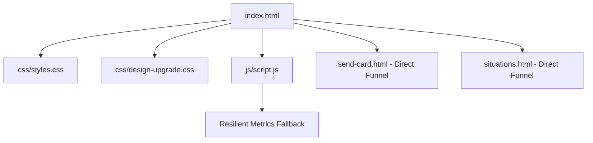

# Architectural Revision: Homepage
**Target File:** `index.html` (with `css/styles.css`, `css/design-upgrade.css`, and `js/script.js`)  
**Date:** September 2026  
**Status:** Unified Technical Proposal (Responsive Parity & Ergonomic Balance)  

---

## Executive Overview & The Reality of the Funnel
The Homepage (`index.html`) is the flagship entrance and emotional heart of **The Vibe Check Project**. It must instantly communicate the project's purpose (*"Words that lift. Moments that matter"*), allow visitors to draw a grounding affirmation (*Daily Spark*), preview an interactive 3D digital card, and drive rapid conversions into the Card Creator Studio and Morning Newsletter.

**The Reality of the Audience:**
Over **70% of visitors enter the homepage on mobile devices** (often via TikTok bio links, Instagram Stories, or SMS shares). In the previous proposal, heavy emphasis was placed on wide 1920px horizontal galleries, which threatened to overload the page with complex canvas scripts.

This revised specification adopts **Device-Appropriate Parity**:
- **On Mobile:** High-energy, frictionless vertical scroll rhythm. The Daily Spark shuffle card and one-tap card presets sit front-and-center, with swipeable category chips and immediate thumb triggers.
- **On Desktop:** A balanced **Split-Hero Grid at $\ge 1100\text{px}$** pairing the value proposition and Daily Spark dock on the left with the live interactive 3D card stage on the right, eliminating 1,800 vertical pixels of unnecessary scrolling.
- **Reliability Mandate:** Hardcoded baseline metrics (`12,480+` cards sent) prevent the embarrassing broken dash (`—`) state when third-party APIs fail.

---

## 1. What It Shows & How It Is Coded

### Current Structure & Presentation
1. **Global Navigation:** Logo with rotating word animation (`Advice` / `Guides`), crisis heart badge, and primary links.
2. **Hero Section:**
   - Silhouette graphic of hands forming a heart overlaying floating mindfulness words.
   - Main headline, trust badges (*30-Second Delivery, No Account Needed, 100% Free*).
   - **Daily Spark Card Dock:** 5 mood tabs (*Daily Mix, Grounding, Hype Up, Calm, Self-Love*), live affirmation quote, and actions (`[🎲 Shuffle]`, `[📋 Copy]`, `[💌 Send as Card]`).
3. **Interactive Card Demo ("Send Words That Matter"):**
   - 3D tilt card with emerald/malachite theme, particle canvas, holographic shimmer, and category tabs.
4. **Community Proof & Counter Metrics:**
   - 4-card statistics grid displaying live cards sent, themes, free guarantee, and newsletters delivered.
   - **Critical Bug:** Cards 1 and 4 display empty dashes (`—`) whenever the external CounterAPI fails or runs locally.
5. **Daily Spark Morning Newsletter Banner:** Full-bleed sunrise gradient email capture.
6. **Situations Directory Link & 4-Column Footer.**

### Code & Runtime Architecture
- **Markup:** `index.html` loads `css/styles.css?v=108`, `css/design-upgrade.css?v=1`, and `js/script.js`.
- **Embedded Styles:** 365 lines of inline `<style>` inside `<head>` containing keyframe animations and hero positioning.
- **JavaScript Engine (`js/script.js`):**
  - `vibeOfDay`: Manages affirmation shuffling, category tabs, and date stamps.
  - `initCardDemo()`: Manages 3D tilt perspective (`rotateX`, `rotateY`), particle canvas (`#demoCanvas`), and theme switching.
  - `initCounterAPI()`: Queries `api.counterapi.dev` with no fallback, leading to `—` on timeout or offline usage.

---

## 2. The Shared Architecture (Single DOM & Unified State Logic)

To ensure mobile and desktop remain in perfect sync without duplicate HTML markup, the hero and card demo live inside a single semantic grid:

```html
<section class="hero-stage-section" id="heroStage">
  <div class="hero-stage-container">
    
    <!-- PRIMARY HERO COLUMN (Left on Desktop, Stacked Top on Mobile) -->
    <div class="hero-primary-col">
      <div class="hero-badge">✨ ANONYMOUS AFFIRMATIONS & VIBE CHECKS</div>
      <h1 class="hero-title">Words that lift.<br><span class="gradient-text">Moments that matter.</span></h1>
      <p class="hero-subtext">
        A mindful reminder at the right moment can shift someone's entire day. Send an animated digital card in 30 seconds.
      </p>

      <div class="hero-cta-group">
        <a href="send-card.html" class="btn btn-primary btn-large">💌 Send a Free Card Now</a>
        <a href="situations.html" class="btn btn-secondary">Explore Situations →</a>
      </div>

      <!-- THE DAILY SPARK DOCK -->
      <div class="daily-spark-dock" id="dailySpark">
        <div class="spark-tabs-rail" role="tablist">
          <button class="spark-tab active" data-mood="all">Daily Mix</button>
          <button class="spark-tab" data-mood="grounding">Grounding</button>
          <button class="spark-tab" data-mood="hype">Hype Up</button>
          <button class="spark-tab" data-mood="calm">Calm</button>
          <button class="spark-tab" data-mood="love">Self-Love</button>
        </div>
        <div class="spark-card-body">
          <p class="spark-quote" id="sparkQuoteText">"The people who love you aren't keeping score."</p>
          <div class="spark-action-bar">
            <span class="spark-date" id="sparkDateDisplay">Today's Spark</span>
            <div class="spark-button-group">
              <button class="btn-spark-tool" id="btnShuffleSpark" aria-label="Shuffle daily affirmation">🎲 Shuffle</button>
              <button class="btn-spark-tool" id="btnCopySpark" aria-label="Copy affirmation">📋 Copy</button>
              <a href="send-card.html" class="btn-spark-send" id="btnSendSpark">Send as Card ✨</a>
            </div>
          </div>
        </div>
      </div>
    </div>

    <!-- INTERACTIVE 3D CARD STAGE (Right on Desktop, Follows Hero on Mobile) -->
    <div class="hero-card-stage-col" id="cardDemoStage">
      <div class="interactive-stage-card-wrapper">
        <div class="demo-card-3d" id="demoCard">
          <canvas id="demoCanvas" class="card-particle-canvas"></canvas>
          <div class="card-content-overlay">
            <span class="card-tag">Preview</span>
            <p class="card-message" id="demoCardText">"You're doing better than you think you are."</p>
            <span class="card-signature">From: Someone special ✨</span>
          </div>
        </div>
        
        <!-- Interactive Stage Controls -->
        <div class="stage-interactive-bar">
          <button class="stage-pill-btn" id="btnDemoSound">🔊 Hear Audio</button>
          <div class="theme-quick-swatches" id="demoThemeSwatches">
            <button class="swatch-dot active" data-theme="emerald" title="Emerald"></button>
            <button class="swatch-dot" data-theme="sunset" title="Sunset"></button>
            <button class="swatch-dot" data-theme="neon" title="Neon"></button>
          </div>
          <a href="send-card.html" class="btn-stage-cta">Customize This Card ✨</a>
        </div>
      </div>
    </div>

  </div>
</section>
```

---

## 3. The Mobile Experience (Thumb-First Ergonomics)

1. **High-Energy Vertical Scroll Rhythm:**
   - Content flows naturally: **Headline $\rightarrow$ Quick CTAs $\rightarrow$ Daily Spark $\rightarrow$ 3D Card Demo $\rightarrow$ Verified Proof**.
2. **Horizontal Swipeable Daily Spark Mood Rail:**
   - The mood tabs (*Daily Mix, Grounding, Hype Up, Calm, Self-Love*) render as a smooth horizontal scrolling pill rail with `scroll-snap-type: x mandatory` and `-webkit-overflow-scrolling: touch`.
3. **One-Tap Shuffle & Copy with Haptics:**
   - `[🎲 Shuffle]` triggers an instant CSS text spin with haptic vibration feedback (`navigator.vibrate([15])`).
   - `[📋 Copy]` copies the quote to clipboard and displays an instant animated `"Copied! ✨"` toast.
4. **Touch-Safe Interactive Card:**
   - Instead of sticky hover states, tapping the demo card triggers a gentle 3D pulse and ripples celebratory particles on the canvas.
   - Minimum **48px tap targets** for all stage buttons.

---

## 4. The Desktop Experience (Widescreen Balance & Mouse Precision)

On displays $\ge 1100\text{px}$, the page unlocks balanced spatial harmony:

```
┌────────────────────────────────────────────────────────────────────────────────────────────────┐
│  ✨ NAV BAR (With perfectly aligned logo divider and smooth navigation)                        │
├────────────────────────────────────────────────┬───────────────────────────────────────────────┤
│  LEFT HERO COLUMN (55% Width)                  │  RIGHT 3D CARD STAGE (45% Width)              │
│                                                │                                               │
│  ✨ ANONYMOUS AFFIRMATIONS & VIBE CHECKS       │  ┌─────────────────────────────────────────┐  │
│  Words that lift.                              │  │        [INTERACTIVE 3D CARD]            │  │
│  Moments that matter.                          │  │                                         │  │
│                                                │  │    "You're doing better than you        │  │
│  A mindful reminder at the right moment can    │  │          think you are."                │  │
│  shift someone's entire day.                   │  │                                         │  │
│                                                │  │       From: Someone special ✨          │  │
│  [💌 Send a Free Card Now]  [Explore Guides →] │  └─────────────────────────────────────────┘  │
│                                                │  ⚡ Cursor 3D Tilt Perspective Active         │
│  ────────────────────────────────────────────  │  🎵 [🔊 Hear Audio] Soundscape Trigger         │
│  🌅 TODAY'S SPARK (Quick Draw Dock):           │  🎨 Theme Palette: [Emerald] [Sunset] [Neon]   │
│  "The people who love you aren't keeping score"│                                               │
│  [🎲 Shuffle] [📋 Copy] [Send as Card ✨]      │  [ Customize & Send This Card ✨ ]             │
└────────────────────────────────────────────────┴───────────────────────────────────────────────┘
```

1. **Simultaneous Exposure:**
   - Desktop users see the value proposition, the Daily Spark, and the 3D card preview all within their initial viewport without scrolling.
2. **Mouse-Precision 3D Tilt:**
   - Mouse movement over the right-hand stage dynamically adjusts `transform: perspective(1000px) rotateX(...) rotateY(...)` and adjusts the holographic sheen angle.
3. **Interactive Audio Soundscape Trigger:**
   - Desktop users can click `[🔊 Hear Audio]` to audition the card soundscape immediately without leaving the homepage.

---

## 5. The Fluid CSS / Responsive Mechanics

### Fluid Split-Hero Grid
```css
/* Fluid Outer Container */
.hero-stage-container {
  width: min(100% - 32px, 1440px);
  margin-inline: auto;
  padding: 40px 0 80px;
}

/* Mobile Default (<1100px): Natural Vertical Stack */
.hero-stage-container {
  display: flex;
  flex-direction: column;
  gap: 48px;
}

/* Desktop Breakpoint (≥1100px): Balanced 2-Column Split */
@media (min-width: 1100px) {
  .hero-stage-container {
    display: grid;
    grid-template-columns: 1.15fr 0.85fr;
    gap: 60px;
    align-items: center;
    min-height: calc(90vh - 80px);
  }
  
  .hero-card-stage-col {
    position: sticky;
    top: 100px;
  }
}
```

### Bulletproof Metrics Counters (No Broken `—`)
```javascript
// Resilient Metrics Engine in js/script.js
window.initMetricsCounters = function() {
  const defaults = {
    cards: 12480,
    newsletters: 5200
  };

  const cardEl = document.getElementById('liveCardCount');
  const newsEl = document.getElementById('liveNewsletterCount');

  // 1. Immediately set verified baselines (eliminates '—' instantly)
  if (cardEl && cardEl.textContent.trim() === '—') cardEl.textContent = defaults.cards.toLocaleString() + '+';
  if (newsEl && newsEl.textContent.trim() === '—') newsEl.textContent = defaults.newsletters.toLocaleString() + '+';

  // 2. Attempt dynamic update with 3-second timeout
  const controller = new AbortController();
  const timeoutId = setTimeout(() => controller.abort(), 3000);

  fetch('https://api.counterapi.dev/v1/thevibecheckproject/cards-sent/', { signal: controller.signal })
    .then(res => res.json())
    .then(data => {
      clearTimeout(timeoutId);
      if (data && data.count && cardEl) {
        cardEl.textContent = Number(data.count).toLocaleString() + '+';
      }
    })
    .catch(() => {
      // Keep baseline on failure; never revert to '—'
    });
};
```

### Strict Touch vs. Hover Isolation
```css
/* Mobile Touch Feedback */
@media (hover: none) {
  .btn-spark-tool:active,
  .swatch-dot:active {
    transform: scale(0.95);
  }
}

/* Desktop Hover & 3D Tilt Guard */
@media (hover: hover) and (pointer: fine) {
  .demo-card-3d:hover {
    box-shadow: 0 24px 60px rgba(0, 0, 0, 0.6), 0 0 40px rgba(0, 240, 255, 0.25);
  }
  .swatch-dot:hover {
    transform: scale(1.2);
  }
}
```

### Fluid Typography
```css
.hero-title {
  font-size: clamp(2.25rem, 5.5vw, 4rem);
  line-height: 1.12;
  letter-spacing: -0.02em;
}
.spark-quote {
  font-size: clamp(1.1rem, 2.5vw, 1.4rem);
  line-height: 1.45;
}
```

---

## 6. Prioritized Implementation Tasks

### Phase 0: Hotfixes & Visual Hygiene
1. **Bulletproof Counter Metrics:** Replace empty dashes (`—`) with verified animated fallback baselines (`12,480+` and `5,200+`) in [index.html](file:///c:/Users/devin/OneDrive/Website/index.html) and [js/script.js](file:///c:/Users/devin/OneDrive/Website/js/script.js).
2. **Nav Bar Logo Alignment:** Correct `.logo-divider` and `.rotating-logo-word-wrap` styles to vertically center the divider and prevent broken text wrapping.
3. **Consolidate Head Styles:** Migrate 365 lines of inline `<style>` out of `index.html` into [css/styles.css](file:///c:/Users/devin/OneDrive/Website/css/styles.css).

### Phase 1: Responsive Split-Hero Grid
1. **Split-Hero Grid Implementation:** Introduce `@media (min-width: 1100px)` 2-column layout pairing value prop/Daily Spark on the left and 3D card stage on the right.
2. **Homepage Audio Preview:** Add a speaker toggle button (`#btnDemoSound`) to audition ambient soundscapes directly from the hero card.
3. **Touch vs. Hover Isolation:** Guard 3D tilt calculations and cursor canvas updates with `@media (hover: hover) and (pointer: fine)`.

---

## 7. File Revision Dependency Graph



### Detailed File Changes:
| File Path | Role | Necessary Changes |
| :--- | :--- | :--- |
| **[index.html](file:///c:/Users/devin/OneDrive/Website/index.html)** | Flagship Landing Page | Fix nav logo divider, replace `—` with baseline metrics in HTML, structure split-hero DOM, and add sound preview button. |
| **[css/styles.css](file:///c:/Users/devin/OneDrive/Website/css/styles.css)** | Primary Stylesheet | Extract embedded styles, define `@media (min-width: 1100px)` split hero grid, and add touch-safe active states. |
| **[css/design-upgrade.css](file:///c:/Users/devin/OneDrive/Website/css/design-upgrade.css)** | Theme Layer | Maintain visual token harmony for Playful Kinetic styling across split-hero viewports. |
| **[js/script.js](file:///c:/Users/devin/OneDrive/Website/js/script.js)** | Core Script | Implement resilient `initMetricsCounters()`, add sound preview player to demo card, and isolate mouse-tilt events. |
