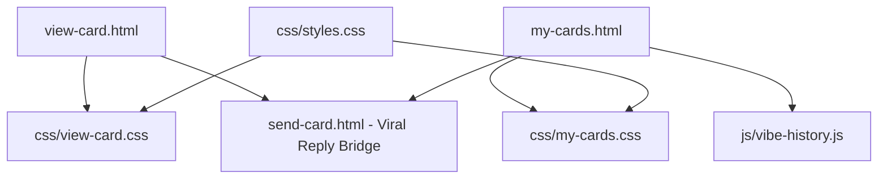

# Architectural Revision: Recipient Experience & Sender Dashboard
**Target Files:** `view-card.html` (Recipient Experience) & `my-cards.html` (Sender Dashboard)  
**Date:** September 2026  
**Status:** Unified Technical Proposal (Responsive Parity & Ergonomic Balance)  

---

## Executive Overview & The Reality of the Funnel
Together, `view-card.html` and `my-cards.html` represent the **reciprocal viral loop and retention engine** of **The Vibe Check Project**:
1. **`view-card.html` is the emotional climax:** When a recipient taps a private link received via text or message, this page delivers the unboxing payoff (ambient soundscape, card reveal, confetti explosion, and heartfelt personal note). Its primary conversion mission is the **Reciprocal Viral Bridge**: prompting the recipient to immediately *"Make their day right back!"*.
2. **`my-cards.html` is the privacy-first memory hub:** Senders track and revisit cards they've sent, check if their card has been opened, and re-share links without needing an account.

**The Reality of the Audience:**
Over **85% of recipients open `view-card.html` on a smartphone** directly from an SMS, WhatsApp, or Instagram DM. The previous proposal leaned too heavily into a widescreen desktop stage that risked breaking the mobile story feel.

This revised specification implements **Device-Appropriate Parity**:
- **On Mobile:** An immersive, **Full-Viewport Story/Reel Experience**. The envelope fills the vertical screen, pops open with sound and haptic vibration on tap, and smoothly slides the reciprocal reply drawer up from the bottom thumb zone.
- **On Desktop:** A **Cinematic Split Stage with Zero Cumulative Layout Shift (CLS)**. The card rests on the left in ambient 3D perspective, while the reciprocal action deck illuminates on the right upon reveal without causing any sudden layout jumps.

---

## 1. What It Shows & How It Is Coded

### Current Experience & Presentation
1. **`view-card.html` (Recipient Viewer):**
   - Glowing loading orb (`.loader-orb`) while decoding URL payload.
   - Sealed pre-reveal card with pulsing green heart (`💚`) and *"Tap to reveal your message"*.
   - **Flip & Reveal:** 3D flip animation, confetti burst (`launchConfetti()`), audio soundscape playback, and display of affirmation quote, sender name, and personal note.
   - **Post-Reveal Content Stream:** Reciprocal viral reply buttons (*"Send a Thank You Vibe"* / *"Send Warm Energy Back"*), card share buttons, and Morning Spark email capture.
2. **`my-cards.html` (Sender Dashboard):**
   - Header with sent count metrics (*Vibes Crafted*, *Opened By Friends*, *Private to Device*).
   - Real-time search bar and theme filter chips.
   - Grid of sent cards showing recipient names, timestamps, and open indicators.
   - **Laptop Flaw:** The empty state container has excessive vertical padding, causing the CTA button to be clipped on standard 768px–900px laptop screens.

### Code Architecture Audit
- **Zero-Database URL Query Architecture:**
  - Card data is entirely encapsulated within the URL query parameter (`?data=` base64url string).
  - `window.decodeVibeCard()` unpacks the recipient, sender, affirmation, note, theme, and soundscape on the client side.
- **Viral Reply Logic:** Lines 407–441 in `view-card.html` dynamically generate return links:  
  `send-card.html?recipient=${encodeURIComponent(sender)}&message=${msg}&viralReply=1`.

---

## 2. The Shared Architecture (Single DOM & Unified State Logic)

To prevent layout shift and maintain component parity, `view-card.html` employs a single semantic structure where layout grid slots are pre-reserved:

```html
<main class="recipient-viewport-stage">
  <!-- Top Ambient Control Bar (Mute / Soundscape Control) -->
  <header class="viewer-top-bar">
    <div class="viewer-brand">✨ The Vibe Check Project</div>
    <div class="viewer-audio-controls">
      <button class="audio-toggle-pill" id="btnToggleAudio" aria-label="Toggle soundscape audio">
        <span class="audio-wave-bars"><span></span><span></span><span></span></span>
        <span class="audio-label" id="audioLabelText">Sound On</span>
      </button>
    </div>
  </header>

  <!-- Single Unified Responsive Grid (Zero-CLS Layout) -->
  <div class="recipient-grid-container" id="recipientGrid">
    
    <!-- SLOT A: Interactive 3D Card Stage -->
    <section class="card-display-column" id="cardDisplayCol">
      <div class="card-envelope-wrapper" id="envelopeWrapper">
        <div class="vibe-card-3d" id="vibeCard3D" role="button" tabindex="0" aria-label="Tap to open your vibe check card">
          
          <!-- Front / Sealed Envelope Face -->
          <div class="card-side card-envelope-front" id="cardSealedSide">
            <div class="envelope-ambient-glow"></div>
            <div class="envelope-seal-badge">
              <span class="seal-icon">💌</span>
              <span class="seal-pulse"></span>
            </div>
            <h2 class="envelope-headline">You've got a Vibe Check!</h2>
            <p class="envelope-subtext">Tap anywhere to reveal your message</p>
          </div>

          <!-- Back / Unboxed Card Face -->
          <div class="card-side card-unboxed-face" id="cardRevealedSide">
            <div class="card-theme-canvas" id="recipientCardCanvas"></div>
            <div class="card-inner-body">
              <div class="card-chip-tag">For You ✨</div>
              <blockquote class="card-affirmation" id="cardAffirmationQuote">
                "You're doing better than you think you are."
              </blockquote>
              <div class="card-attribution" id="cardSenderAttribution">From: Someone special ✨</div>
              <div class="card-personal-note" id="cardPersonalNoteBox">
                <p class="note-label">Personal Note:</p>
                <p class="note-text" id="cardPersonalNoteText">Thinking of you today!</p>
              </div>
            </div>
          </div>

        </div>
      </div>
    </section>

    <!-- SLOT B: Reciprocal Viral Deck (Slides up on Mobile, Appears Side-by-Side on Desktop) -->
    <section class="reciprocal-action-column" id="reciprocalDeck" aria-live="polite">
      <div class="reciprocal-deck-inner">
        <div class="reciprocal-header">
          <span class="badge-sparkle">✨ Pay It Forward</span>
          <h3 class="reciprocal-title">Make their day right back!</h3>
          <p class="reciprocal-subtext" id="reciprocalSubtitle">
            Someone took a moment out of their day just to make you smile.
          </p>
        </div>

        <!-- 1-Click Viral Reply Triggers -->
        <div class="reciprocal-button-stack">
          <a href="#" class="btn-reply-action" id="btnReplyThankYou">
            <span class="reply-emoji">💌</span>
            <span class="reply-copy">Send a "Thank You" Vibe</span>
          </a>
          <a href="#" class="btn-reply-action" id="btnReplyWarmth">
            <span class="reply-emoji">🫂</span>
            <span class="reply-copy">Send Warm Energy Back</span>
          </a>
        </div>

        <!-- Social Share & Keepsake Actions -->
        <div class="recipient-utility-row">
          <button class="btn-utility-tool" id="btnSaveKeepsake">
            <svg>...</svg> <span>Save Keepsake PNG</span>
          </button>
          <button class="btn-utility-tool" id="btnShareCardLink">
            <svg>...</svg> <span>Share Link</span>
          </button>
        </div>

        <!-- Morning Spark Newsletter Bridge -->
        <div class="recipient-newsletter-card">
          <h4>Want morning mindfulness like this?</h4>
          <form class="mini-newsletter-form" id="viewerNewsletterForm">
            <input type="email" placeholder="Your email..." required aria-label="Email for Morning Spark">
            <button type="submit" class="btn btn-primary">Join Free ✨</button>
          </form>
        </div>
      </div>
    </section>

  </div>
</main>
```

---

## 3. The Mobile Experience (Thumb-First Ergonomics)

1. **Full-Viewport Story Immersion:**
   - On mobile, `.recipient-viewport-stage` occupies `100dvh` (dynamic viewport height). The sealed envelope is centered vertically like an Instagram Story or TikTok card reveal.
2. **Haptic & Sound Unlock on Tap:**
   - Tapping anywhere on the envelope invokes:
     - 20ms haptic vibration (`navigator.vibrate([20])`).
     - Web Audio soundscape playback (`audio.play()`).
     - 2D Canvas confetti burst (`launchConfetti()`).
     - Smooth 3D card flip transform (`rotateY(180deg)`).
3. **Smooth Bottom-Sheet Slide Up:**
   - Once revealed, the page smoothly auto-scrolls 80px down to reveal the reciprocal reply options.
   - The primary reply triggers **`[Send a "Thank You" Vibe]`** and **`[Send Warm Energy Back]`** sit in the bottom 40% thumb zone with comfortable **52px touch targets**.
4. **Native Mobile Share Sheet:**
   - Tapping `[Share Link]` triggers `navigator.share({ title: "Someone sent me a Vibe Check!", url: window.location.href })` for instant iMessage or WhatsApp forwarding.

---

## 4. The Desktop Experience (Widescreen Balance & Mouse Precision)

On screens $\ge 1100\text{px}$, the experience transforms into a **Cinematic Side-by-Side Gift Reveal**:

```
┌────────────────────────────────────────────────────────────────────────────────────────────────────────┐
│  ✨ The Vibe Check Project                                                      [🔊 Soundscape: Playing]
├──────────────────────────────────────────┬─────────────────────────────────────────────────────────────┤
│  LEFT COLUMN: 3D CARD STAGE (55% Width)  │  RIGHT COLUMN: RECIPROCAL ACTION DECK (45% Width)           │
│                                          │  (Fades & slides in seamlessly upon reveal - ZERO CLS)      │
│  ┌────────────────────────────────────┐  │                                                             │
│  │   [FULL-SIZE 3D GLOWING CARD]      │  │  ✨ PAY IT FORWARD                                          │
│  │                                    │  │  Make their day right back!                                 │
│  │   "You're doing better than you    │  │  Sarah took time out of her day just to make you smile.     │
│  │          think you are."           │  │                                                             │
│  │                                    │  │  [💌 Send a "Thank You" Vibe to Sarah]                      │
│  │   From: Sarah                      │  │  [🫂 Send Warm Energy Back]                                 │
│  │   Note: "Thinking of you today!    │  │                                                             │
│  │   You've got this! 💛"             │  │  ─────────────────────────────────────────────────────────  │
│  └────────────────────────────────────┘  │  [📸 Save Keepsake Image (PNG)]  [📋 Copy Card Link]        │
│  Ambient Aurora Glow Reactive to Theme   │                                                             │
│  Interactive Mouse-Tilt Perspective      │  🎁 Want daily affirmations like this?                      │
│                                          │  [ your@email.com ]  [ Join Morning Spark ✨ ]              │
└──────────────────────────────────────────┴─────────────────────────────────────────────────────────────┘
```

1. **Zero Cumulative Layout Shift (CLS):**
   - The desktop grid pre-reserves the right column space (`grid-template-columns: 1.15fr 0.85fr;`).
   - Prior to card reveal, the right deck is softly dimmed or previews a subtle teaser (*"Your card is waiting..."*). When the card flips, the reciprocal deck illuminates with a smooth fade-and-slide animation without moving the card an inch.
2. **Interactive 3D Mouse Tilt:**
   - Mouse movement over the revealed card tilts it in 3D space (`perspective(1200px)`), casting realistic dynamic shadows.
3. **Audio Control Pill:**
   - Desktop users can pause, mute, or replay the soundscape via a persistent audio badge in the top right.

---

## 5. The Fluid CSS / Responsive Mechanics

### Fluid Grid & Zero-CLS Layout
```css
/* Shared Stage Container */
.recipient-grid-container {
  width: min(100% - 32px, 1320px);
  margin-inline: auto;
  min-height: calc(100dvh - 100px);
  display: flex;
  flex-direction: column;
  justify-content: center;
  align-items: center;
  gap: 32px;
}

/* Desktop Breakpoint (≥1100px): Side-by-Side Zero-CLS Grid */
@media (min-width: 1100px) {
  .recipient-grid-container {
    display: grid;
    grid-template-columns: 1.15fr 0.85fr;
    gap: 64px;
    align-items: center;
  }
  
  /* Right column pre-allocated: Zero CLS */
  .reciprocal-action-column {
    opacity: 0;
    transform: translateX(20px);
    transition: opacity 0.6s cubic-bezier(0.16, 1, 0.3, 1), transform 0.6s cubic-bezier(0.16, 1, 0.3, 1);
    pointer-events: none;
  }
  
  .recipient-grid-container.card-revealed .reciprocal-action-column {
    opacity: 1;
    transform: translateX(0);
    pointer-events: auto;
  }
}
```

### Pre-Flip Neon Ambient Glow
```css
/* Inviting Pre-Reveal Pulse */
.card-envelope-front {
  background: var(--color-bg-medium, #18181F);
  border: 2px solid rgba(255, 255, 255, 0.12);
  box-shadow: 0 12px 40px rgba(0, 0, 0, 0.6), 0 0 45px rgba(205, 255, 96, 0.2);
  animation: envelopeFloat 3s ease-in-out infinite alternate;
}

@keyframes envelopeFloat {
  0% { transform: translateY(0px); }
  100% { transform: translateY(-8px); }
}
```

### Strict Touch vs. Hover Isolation
```css
/* Mobile Touch Target */
@media (hover: none) {
  .btn-reply-action:active {
    transform: scale(0.97);
  }
}

/* Desktop Hover & Tilt */
@media (hover: hover) and (pointer: fine) {
  .btn-reply-action:hover {
    transform: translateY(-3px);
    box-shadow: 0 12px 28px rgba(0, 0, 0, 0.4), 0 0 20px rgba(255, 107, 157, 0.3);
  }
  .card-unboxed-face:hover {
    transform: perspective(1000px) rotateY(-4deg) rotateX(2deg);
  }
}
```

---

## 6. Sender Dashboard Parity (`my-cards.html`)

1. **Laptop Screen Padding Fix:**
   - Change `.my-cards-empty` container from `padding: 120px 20px` to `padding: clamp(40px, 8vh, 80px) 20px`, ensuring the `[✨ Send New Card]` button is 100% visible on 768px–900px laptop screens without scrolling.
2. **Mobile Card List Ergonomics:**
   - Display sent cards as full-width list items with generous thumb targets for copying links, viewing cards, and deletion.
3. **Desktop 3D Card Inspector Drawer:**
   - On screens $\ge 1200\text{px}$, clicking any card in the table slides open a right-hand inspection drawer rendering a live 3D preview of the card and a 1-click **`[Check In Again]`** follow-up trigger.

---

## 7. Prioritized Implementation Tasks

### Phase 0: Hotfixes & Visual Polish
1. **Pre-Flip Neon Glow:** Enhance `.card-envelope-front` in [css/view-card.css](file:///c:/Users/devin/OneDrive/Website/css/view-card.css) with an illuminated glow and floating animation.
2. **Audio Control Pill:** Add the persistent audio mute/replay button to the header of [view-card.html](file:///c:/Users/devin/OneDrive/Website/view-card.html).
3. **Empty State Padding Fix:** Adjust `.my-cards-empty` padding in [css/my-cards.css](file:///c:/Users/devin/OneDrive/Website/css/my-cards.css) to eliminate vertical clipping on laptops.

### Phase 1: Zero-CLS Split Desktop Grid & Keepsake Export
1. **Zero-CLS Responsive Layout:** Implement `@media (min-width: 1100px)` side-by-side reveal grid in [css/view-card.css](file:///c:/Users/devin/OneDrive/Website/css/view-card.css).
2. **Save Keepsake Image (PNG):** Add HTML5 canvas PNG export logic so recipients can save high-res card wallpapers.
3. **Follow-Up Check-in Shortcut:** Add the "Check In Again" button to [my-cards.html](file:///c:/Users/devin/OneDrive/Website/my-cards.html) that pre-populates recipient details in `send-card.html`.

---

## 8. File Revision Dependency Graph



### Detailed File Changes:
| File Path | Role | Necessary Changes |
| :--- | :--- | :--- |
| **[view-card.html](file:///c:/Users/devin/OneDrive/Website/view-card.html)** | Recipient Experience | Reorganize into zero-CLS 2-column grid, add audio mute button, add pre-flip neon glow, and add keepsake PNG export trigger. |
| **[css/view-card.css](file:///c:/Users/devin/OneDrive/Website/css/view-card.css)** | Viewer Styles | Define `@media (min-width: 1100px)` side-by-side layout, envelope floating animation, and touch-isolated states. |
| **[my-cards.html](file:///c:/Users/devin/OneDrive/Website/my-cards.html)** | Sender Dashboard | Fix empty state padding, add desktop card inspection drawer markup, and add "Check In Again" follow-up buttons. |
| **[css/my-cards.css](file:///c:/Users/devin/OneDrive/Website/css/my-cards.css)** | Dashboard Styles | Implement inspection drawer slide-out rules and mobile thumb-friendly card list styling. |
| **[js/vibe-history.js](file:///c:/Users/devin/OneDrive/Website/js/vibe-history.js)** | Dashboard Engine | Add drawer inspection handler and follow-up card pre-fill handoff. |
