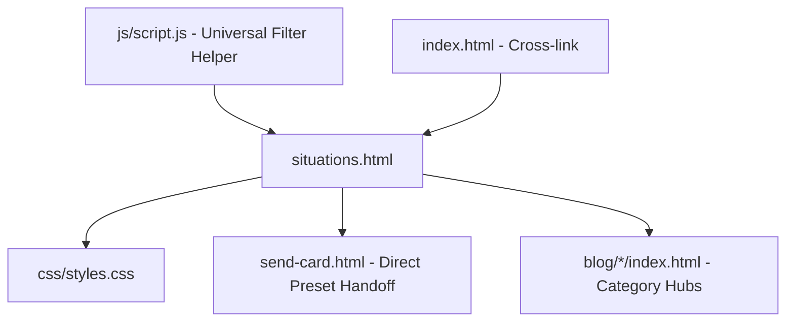

# Architectural Revision: Situations Directory
**Target File:** `situations.html` (with `css/styles.css` & `js/script.js`)  
**Date:** September 2026  
**Status:** Unified Technical Proposal (Responsive Parity & Ergonomic Balance)  

---

## Executive Overview & The Reality of the Funnel
The Situations Directory (`situations.html`) is the **emotional directory and decision compass** for **The Vibe Check Project**. When users experience support paralysis because a loved one is facing hardship (*panic attacks, grief, hospital stays, quiet withdrawal*), they turn to this page for exact words, scripts, and pre-written affirmation templates.

**The Reality of the Audience:**
Over **70% of people in high-stress support situations search for help on their phones**. The previous desktop-heavy proposal focused excessively on filling 1920px margins with a 4-column matrix, neglecting the urgent need for quick mobile scanning and 1-tap card creation.

This revised specification adopts **Device-Appropriate Parity**:
- **On Mobile:** Fast, high-legibility 1-column card stack with an edge-to-edge swipeable topic rail (*Grief, Mental Health, Breakups, Hype*) and large 48px thumb-friendly buttons.
- **On Desktop:** A balanced **2-Column Layout** pairing a sticky left search and category navigation rail with an expansive multi-column card grid on the right (expanding to 3–4 columns on $\ge 1400\text{px}$).
- **The Core Conversion Fix (Dual-Action Cards):** Every card gains a direct **`[💌 Send Card ✨]`** shortcut button that deep-links into the Card Creator with that situation's theme and affirmation pre-selected, eliminating unnecessary clicks through blog articles.
- **Universal Filter Engine:** Powered by the shared client-side filter helper in [js/script.js](file:///c:/Users/devin/OneDrive/Website/js/script.js) (zero standalone search scripts).

---

## 1. What It Shows & How It Is Coded

### Current Directory Structure
1. **Hero Header:** Display title `"What's the Situation?"` and empathetic subtitle.
2. **12 Situation Cards across 4 Pillars:**
   - **🕊️ Grief & Hardship:** *Grief Support Guide*, *Sympathy Card Messages*, *Serious Illness & Hospital*.
   - **🧠 Mental Health & Burnout:** *Mental Health Hub*, *Anxiety & Panic Texts*, *When They Want to Give Up*.
   - **💔 Relationships & Heartbreak:** *Breakup Support Texts*, *The Post-Breakup Playbook*, *When They Go Quiet*.
   - **✨ Everyday Encouragement:** *Motivation & Hype Hub*, *Hype Texts & Cards*, *"Just Because" Texts*.
3. **Card Anatomy:** Emoji icon badge, `h3` headline, 2-line description, and single text link (`Read Guide →`).

### Code Architecture Audit
- **Markup:** `situations.html` contains 140 lines of embedded `<style>` in `<head>`.
- **CSS:** Rigid `.category-group` with `max-width: 1000px; margin: 0 auto;`.
- **Scripts:** Contains **zero JavaScript** beyond basic navigation. There is currently no search input or category filtering.

---

## 2. The Shared Architecture (Single DOM & Unified State Logic)

To guarantee flawless responsive parity, the directory lives in a single semantic layout where categories and search operate identically across all viewports:

```html
<main class="situations-workspace">
  <!-- Shared Search & Filter Rail (Swipeable Pills on Mobile, Sticky Left Rail on Desktop) -->
  <aside class="situations-filter-rail" id="situationsFilterRail">
    <div class="situations-search-box">
      <input type="search" id="situationsSearchInput" placeholder="Filter scenario: breakup, panic, loss..." aria-label="Search situations">
    </div>
    <div class="situations-pills-rail" role="tablist">
      <button class="filter-pill active" data-filter="all">All Situations (12)</button>
      <button class="filter-pill" data-filter="grief">Grief & Loss (3)</button>
      <button class="filter-pill" data-filter="mental-health">Mental Health (3)</button>
      <button class="filter-pill" data-filter="relationships">Breakups & Quiet (3)</button>
      <button class="filter-pill" data-filter="encouragement">Everyday Hype (3)</button>
    </div>
  </aside>

  <!-- Directory Cards Stream -->
  <div class="situations-content-column" id="situationsContentCol">
    
    <!-- Category Pillar: Grief -->
    <section class="situation-category-block" data-category="grief">
      <h2 class="category-title">🕊️ Grief & Hardship</h2>
      <div class="situation-cards-grid">
        
        <!-- Situation Card with Dual Action Triggers -->
        <article class="situation-card premium-bg-1" data-situation="grief-support">
          <div class="card-icon-wrap">🌧️</div>
          <h3 class="card-title">Grief Support Guide</h3>
          <p class="card-description">What to say when there are no words. Practical templates for profound loss.</p>
          <div class="card-action-row">
            <a href="blog/grief-support/index.html" class="btn-card-read">📖 Read Guide</a>
            <a href="send-card.html?preset=grief" class="btn-card-send">💌 Send Card ✨</a>
          </div>
        </article>

        <article class="situation-card premium-bg-1" data-situation="sympathy">
          <div class="card-icon-wrap">📝</div>
          <h3 class="card-title">Sympathy Card Messages</h3>
          <p class="card-description">Heartfelt, non-cliché messages for condolence cards and texts.</p>
          <div class="card-action-row">
            <a href="blog/sympathy-card-messages/index.html" class="btn-card-read">📖 Read Guide</a>
            <a href="send-card.html?preset=tough_day" class="btn-card-send">💌 Send Card ✨</a>
          </div>
        </article>

        <!-- Additional Cards for Illness, Anxiety, Breakup, etc. -->
      </div>
    </section>

  </div>
</main>
```

### Universal Filter Engine Integration
`situations.html` leverages the shared `window.initItemFilter` helper declared in [js/script.js](file:///c:/Users/devin/OneDrive/Website/js/script.js):

```javascript
// Initialization in situations.html via shared script
document.addEventListener('DOMContentLoaded', () => {
  window.initItemFilter({
    inputId: 'situationsSearchInput',
    containerId: 'situationsContentCol',
    itemSelector: '.situation-card',
    textSelector: '.card-title, .card-description',
    pillSelector: '.filter-pill',
    categoryAttr: 'data-category'
  });
});
```

---

## 3. The Mobile Experience (Thumb-First Ergonomics)

1. **Edge-to-Edge Swipeable Category Rail:**
   - Topic pills (*All*, *Grief*, *Mental Health*, *Relationships*, *Hype*) sit in a smooth horizontal scroll rail with `scroll-snap-type: x mandatory` and `-webkit-overflow-scrolling: touch` directly beneath the search input.
2. **High-Legibility 1-Column Cards:**
   - On screens `<768px`, situation cards expand to full screen width with 16px lateral padding.
   - Large, clear icon badges and high-contrast text ensure effortless reading in stressful or hurried moments.
3. **Stacked Dual-Action Touch Targets (Min 48px):**
   - The card buttons are arranged as two distinct, easily tappable buttons:
     - `[📖 Read Guide & Templates]` (Secondary pill, 48px height)
     - `[💌 Send This Card Directly ✨]` (Primary radiant gradient, 48px height)
   - Active tap feedback: `:active { transform: scale(0.98); }`.

---

## 4. The Desktop Experience (Widescreen Balance & Mouse Precision)

On displays $\ge 1100\text{px}$, the page unlocks an expansive, ergonomic **2-Column Layout**:

```
┌──────────────────────────────────────────────────────────────────────────────────────────────────┐
│  ✨ What's the Situation?                                              [ 🔍 Search any scenario ]│
│  Instant guidance and pre-written cards for when your mind goes blank                            │
├──────────────────────────────┬───────────────────────────────────────────────────────────────────┤
│  LEFT STICKY RAIL (300px)    │  RIGHT EXPANSIVE GRID (3 to 4 Columns on ≥1400px)                 │
│                              │                                                                   │
│  🔍 Scenario Filter:         │  🕊️ GRIEF & HARDSHIP                                              │
│  [Type: loss, panic, quiet]  │  ┌────────────────────┐ ┌────────────────────┐ ┌────────────────┐ │
│                              │  │ 🌧️ Grief Support   │ │ 📝 Sympathy Cards  │ │ 🏥 Illness     │ │
│  Pill Categories:            │  │ "When there are no  │ │ Non-cliché         │ │ Showing up     │ │
│  • All Situations (12)       │  │  words to say..."   │ │ condolences        │ │ without panic  │ │
│  • Grief & Loss (3)          │  │                    │ │                    │ │                │ │
│  • Mental Health (3)         │  │ [📖 Read Guide]     │ │ [📖 Read Guide]     │ │ [📖 Read Guide]│ │
│  • Breakups & Quiet (3)      │  │ [💌 Send Card ✨]   │ │ [💌 Send Card ✨]   │ │ [💌 Send Card] │ │
│  • Everyday Hype (3)         │  └────────────────────┘ └────────────────────┘ └────────────────┘ │
│                              │                                                                   │
│  ⚡ Emergency Notice         │  🧠 MENTAL HEALTH & BURNOUT                                       │
│  • 24/7 Crisis Lifeline (988)│  (Filtered dynamically in real-time as search input changes)      │
└──────────────────────────────┴───────────────────────────────────────────────────────────────────┘
```

1. **Sticky Navigation Rail:**
   - The left rail stays anchored at `top: 100px` as the visitor scrolls through the directory.
2. **Auto-Fit 3-to-4 Column Grid:**
   - Rather than boxing content into a narrow 1000px column, the cards expand naturally into 3 columns on standard laptops and 4 columns on large 1920px monitors.
3. **Hover Preview Tooltip:**
   - Hovering over any situation card reveals a live excerpt quote showing the exact tone of advice inside the guide.

---

## 5. The Fluid CSS / Responsive Mechanics

### Fluid Grid & Responsive Breakpoints
```css
/* Fluid Outer Container */
.situations-workspace {
  width: min(100% - 32px, 1440px);
  margin-inline: auto;
  padding: 40px 0 100px;
}

/* Mobile Default (<1100px): 1-Column Feed */
.situations-workspace {
  display: flex;
  flex-direction: column;
  gap: 24px;
}
.situations-pills-rail {
  display: flex;
  overflow-x: auto;
  gap: 8px;
  padding-bottom: 8px;
  scrollbar-width: none;
}
.situations-pills-rail::-webkit-scrollbar {
  display: none;
}
.situation-cards-grid {
  display: grid;
  grid-template-columns: 1fr;
  gap: 16px;
}

/* Desktop Breakpoint (≥1100px): 2-Column Split */
@media (min-width: 1100px) {
  .situations-workspace {
    display: grid;
    grid-template-columns: 300px 1fr;
    gap: 56px;
    align-items: start;
  }
  
  .situations-filter-rail {
    position: sticky;
    top: 100px;
    max-height: calc(100vh - 120px);
  }
  
  .situations-pills-rail {
    flex-direction: column;
    overflow-x: visible;
  }

  /* Multi-Column Cards Grid */
  .situation-cards-grid {
    grid-template-columns: repeat(auto-fill, minmax(min(100%, 300px), 1fr));
    gap: 24px;
  }
}
```

### Dual-Action Button Row
```css
.card-action-row {
  display: grid;
  grid-template-columns: 1fr 1fr;
  gap: 10px;
  margin-top: 18px;
}
.btn-card-read,
.btn-card-send {
  min-height: 48px;
  display: flex;
  align-items: center;
  justify-content: center;
  border-radius: 12px;
  font-weight: 600;
  font-size: 0.88rem;
  text-decoration: none;
}
.btn-card-read {
  background: rgba(255, 255, 255, 0.08);
  color: var(--color-text-main, #FFFFFF);
}
.btn-card-send {
  background: var(--color-primary, #FF6B9D);
  color: #FFFFFF;
}
```

### Strict Touch vs. Hover Isolation
```css
/* Mobile Touch Feedback */
@media (hover: none) {
  .situation-card:active {
    transform: scale(0.98);
  }
}

/* Desktop Hover Effects */
@media (hover: hover) and (pointer: fine) {
  .situation-card {
    transition: transform 0.2s ease, box-shadow 0.2s ease;
  }
  .situation-card:hover {
    transform: translateY(-4px);
    box-shadow: 0 16px 36px rgba(0, 0, 0, 0.4), 0 0 24px rgba(255, 107, 157, 0.25);
  }
}
```

---

## 6. Prioritized Implementation Tasks

### Phase 0: Hotfixes & Direct Conversion Links
1. **Add Dual-Action `[Send Card ✨]` Triggers:** Add the direct `send-card.html?preset=...` button to all 12 situation cards in [situations.html](file:///c:/Users/devin/OneDrive/Website/situations.html) to instantly boost creator conversion.
2. **Consolidate Styles:** Move 140 lines of inline `<style>` out of `situations.html` into [css/styles.css](file:///c:/Users/devin/OneDrive/Website/css/styles.css).
3. **Ensure Preset Support in Studio:** Verify that [js/send-card-logic.js](file:///c:/Users/devin/OneDrive/Website/js/send-card-logic.js) accepts URL parameters (`?preset=grief`, `?preset=tough_day`) and auto-selects appropriate themes and quotes.

### Phase 1: Responsive Parity & Universal Filter
1. **Initialize Universal Filter:** Connect `#situationsSearchInput` and `.filter-pill` to `initItemFilter` in [js/script.js](file:///c:/Users/devin/OneDrive/Website/js/script.js).
2. **Implement 2-Column Responsive Grid:** Apply `@media (min-width: 1100px)` rules in [css/styles.css](file:///c:/Users/devin/OneDrive/Website/css/styles.css).
3. **Mobile Horizontal Pill Rail:** Enable smooth horizontal scrolling for situation category pills on mobile screens.

---

## 7. File Revision Dependency Graph



### Detailed File Changes:
| File Path | Role | Necessary Changes |
| :--- | :--- | :--- |
| **[situations.html](file:///c:/Users/devin/OneDrive/Website/situations.html)** | Situations Directory | Add dual-action `[Send Card ✨]` buttons, structure 2-column layout DOM with search input & category pills, extract inline styles. |
| **[css/styles.css](file:///c:/Users/devin/OneDrive/Website/css/styles.css)** | Primary Stylesheet | Define `@media (min-width: 1100px)` 2-column layout, multi-column card grids, mobile horizontal scroll pills, and touch-isolated states. |
| **[js/script.js](file:///c:/Users/devin/OneDrive/Website/js/script.js)** | Shared Script | Initialize `initItemFilter()` on `situations.html` for real-time keyword and category filtering. |
| **[send-card.html](file:///c:/Users/devin/OneDrive/Website/send-card.html)** | Target Card Creator | Accept incoming situation presets (`?preset=grief`, `?preset=breakup`) and auto-select matching themes. |
